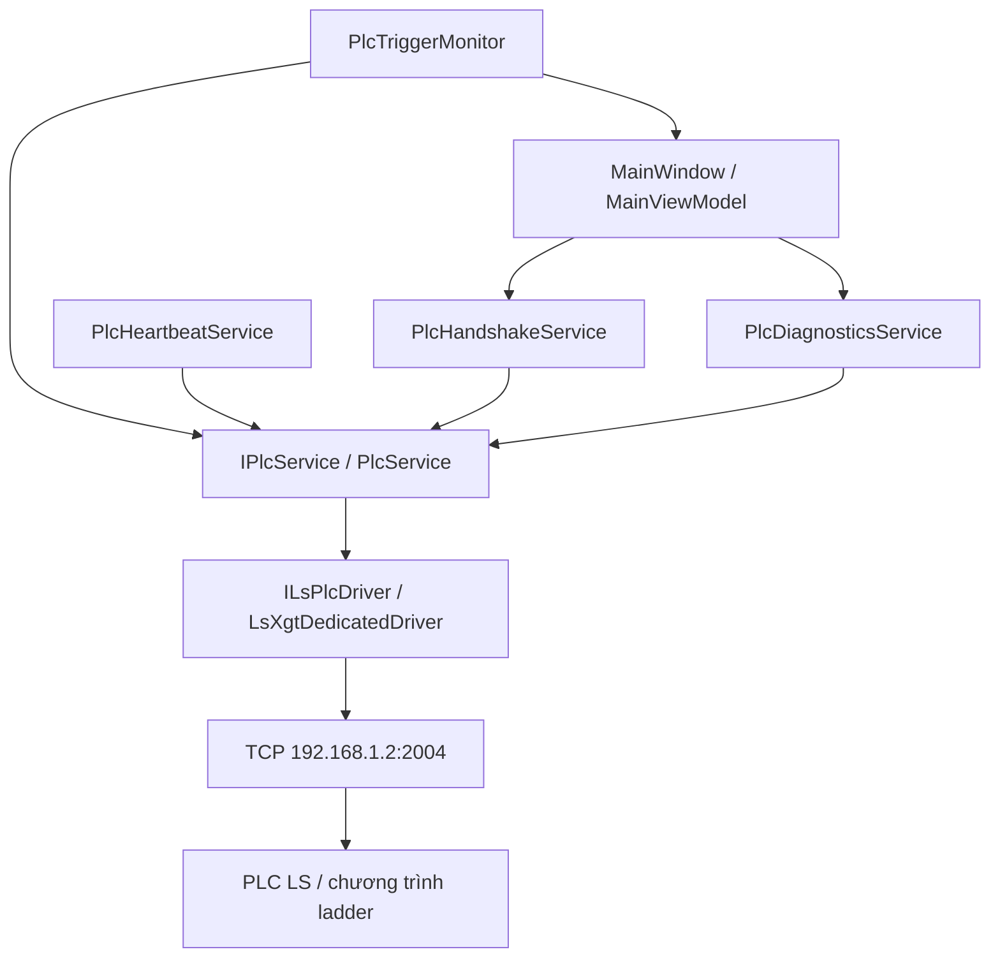
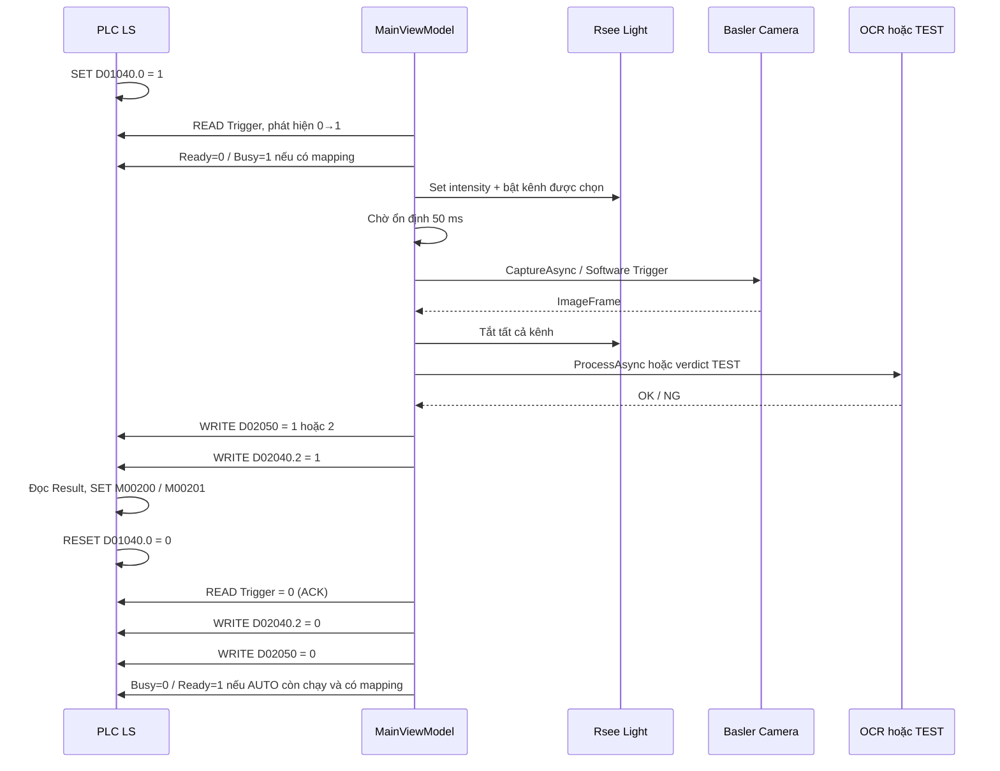

# Luồng code thiết bị và truyền thông PLC — IndustrialVision

**Ngày đối chiếu mã nguồn: 07/10/2026.** Dự án: `D:/PLCls_CONNECT/PLC_ls_connect`.

Tài liệu mô tả **code đang chạy trong ứng dụng**, gồm camera Basler, lens, bộ điều khiển đèn Rsee, PLC LS và phần trả kết quả. Mỗi phần có tên file, tên hàm và liên kết đến dòng code. Luồng chính là:

**PLC phát Trigger → Vision bật đèn → camera chụp → Vision tắt đèn → lấy kết quả OK/NG → ghi Result → bật Complete → PLC hạ Trigger → Vision xóa Complete và Result.**

## Mục lục

1. [Trạng thái hiện tại và phần còn thiếu](#1-trạng-thái-hiện-tại-và-phần-còn-thiếu)
2. [Cấu trúc ứng dụng và cách mở code](#2-cấu-trúc-ứng-dụng-và-cách-mở-code)
3. [Khởi động, cấu hình và lựa chọn driver](#3-khởi-động-cấu-hình-và-lựa-chọn-driver)
4. [Thiết bị và thông số mạng](#4-thiết-bị-và-thông-số-mạng)
5. [Camera Basler: quét, kết nối, LIVE, chụp](#5-camera-basler-quét-kết-nối-live-chụp)
6. [Lens](#6-lens)
7. [Đèn và light controller Rsee](#7-đèn-và-light-controller-rsee)
8. [PLC: kiến trúc và quyền READ/WRITE](#8-plc-kiến-trúc-và-quyền-readwrite)
9. [Địa chỉ XG5000 và địa chỉ XGT](#9-địa-chỉ-xg5000-và-địa-chỉ-xgt)
10. [Gói tin XGT và xử lý TCP](#10-gói-tin-xgt-và-xử-lý-tcp)
11. [Handshake: từng hàm READ/WRITE](#11-handshake-từng-hàm-readwrite)
12. [AUTO và chu trình đầy đủ](#12-auto-và-chu-trình-đầy-đủ)
13. [Đối chiếu ladder PLC đã gửi](#13-đối-chiếu-ladder-plc-đã-gửi)
14. [Heartbeat và giá trị đọc lại](#14-heartbeat-và-giá-trị-đọc-lại)
15. [OCR và kết quả OK/NG](#15-ocr-và-kết-quả-okng)
16. [MANUAL, RESET, lỗi và ngắt kết nối](#16-manual-reset-lỗi-và-ngắt-kết-nối)
17. [Thời gian, luồng nền và giới hạn](#17-thời-gian-luồng-nền-và-giới-hạn)
18. [Bảng tra nút giao diện đến hàm xử lý](#18-bảng-tra-nút-giao-diện-đến-hàm-xử-lý)
19. [Cách build, chạy và quan sát thiết bị thật](#19-cách-build-chạy-và-quan-sát-thiết-bị-thật)
20. [Kết quả đã kiểm tra và phần đã dọn](#20-kết-quả-đã-kiểm-tra-và-phần-đã-dọn)
21. [Tra lỗi theo vị trí code](#21-tra-lỗi-theo-vị-trí-code)
22. [Muốn sửa chức năng thì sửa ở đâu](#22-muốn-sửa-chức-năng-thì-sửa-ở-đâu)

## 1. Trạng thái hiện tại và phần còn thiếu

| Hạng mục | Hành vi hiện tại |
|---|---|
| Camera | Driver thật bằng Basler pylon, hỗ trợ quét, mở camera, LIVE và chụp một ảnh. |
| Lens | Chưa có driver hoặc lệnh điều khiển lens trong dự án. |
| Đèn | Driver TCP Rsee, 8 kênh, chọn kênh dùng khi chụp và cường độ 0–255. |
| PLC | Driver C# XGT Dedicated/FEnet, đọc/ghi bit, word và chuỗi; bắt cạnh Trigger 0→1. |
| Handshake theo ladder | Trigger `D01040.0`, Complete `D02040.2`, Result `D02050`; 1=OK, 2=NG, 0=trống. |
| Heartbeat | Bit riêng `M0030F` đảo ON/OFF và có đọc lại để xác nhận ghi thành công. |
| OCR | **Vẫn dùng MockOcrService, kể cả khi camera/PLC là thiết bị thật.** |
| TEST OK / TEST NG | Có chụp ảnh và điều khiển đèn; kết quả được đặt trước để thử handshake. |
| AUTO trên cấu hình hiện tại | **Bị chặn vì Ready chưa có địa chỉ, trong khi RequiresReadySignal=true.** |
| Chu trình toàn bộ máy thật | Chưa được xác nhận trong lần kiểm tra đã lưu; trước đó mới xác nhận truyền thông PLC thật. |

Hai điểm cần làm rõ với người lập trình PLC trước khi hoàn thiện AUTO:

- `D02040.0` ở rung đầu có phải **Vision Ready do C# ghi** hay là tín hiệu khác?
- `M01000` ở rung tiếp theo đến từ nút Start, cảm biến hay phần logic nào?

Địa chỉ Ready vẫn để trống. Nếu được xác nhận đúng vai trò, địa chỉ XGT tương ứng của `D02040.0` là `%DX32640`. Không dùng địa chỉ này làm heartbeat vì ladder đang đọc nó trong điều kiện bắt đầu.

Vị trí chặn AUTO: [MainViewModel.cs · StartAutoInspectionAsync](D:/PLCls_CONNECT/PLC_ls_connect/src/IndustrialVision.App/ViewModels/MainViewModel.cs:1260). Vị trí đăng ký OCR giả lập: [ServiceRegistration.cs · RegisterRealServices](D:/PLCls_CONNECT/PLC_ls_connect/src/IndustrialVision.App/ServiceRegistration.cs:97).

## 2. Cấu trúc ứng dụng và cách mở code

Sau khi dọn, solution có **7 project ứng dụng**:

| Project | Trách nhiệm |
|---|---|
| `IndustrialVision.App` | WPF, nút giao diện, ViewModel, điều phối chu trình. |
| `IndustrialVision.Core` | Interface, cấu hình, model dữ liệu, enum và exception. |
| `IndustrialVision.Infrastructure` | Đọc JSON, kiểm tra cấu hình, ghi log. |
| `IndustrialVision.Camera` | Driver Basler và camera giả lập dùng khi SimulationMode=true. |
| `IndustrialVision.Light` | Driver Rsee điều khiển đèn thật. |
| `IndustrialVision.Plc` | Driver XGT, PlcService, Trigger, Handshake, Heartbeat, Diagnostics và PLC giả lập trong ứng dụng. |
| `IndustrialVision.Ocr` | Interface được triển khai bởi MockOcrService hiện tại. |

**Điểm bắt đầu để đọc chu trình:** [MainViewModel.cs · ExecuteInspectionCycleAsync](D:/PLCls_CONNECT/PLC_ls_connect/src/IndustrialVision.App/ViewModels/MainViewModel.cs:1314).

`IndustrialVision.Workflow/MachineStateMachine` trước đây chỉ là khung chưa được đăng ký/gọi bởi desktop. Phần này đã được bỏ cùng các kiểu dữ liệu chưa có nơi dùng. Chu trình thực tế vẫn ở `MainViewModel`.

### 2.1 Cách dùng liên kết trong tài liệu

Các liên kết code trỏ đến đường dẫn tuyệt đối trong workspace hiện tại, có `:số_dòng`. Số dòng được lấy tự động từ file nguồn tại ngày lập tài liệu.

Nếu Markdown viewer không mở được trực tiếp dòng:

1. Mở file theo đường dẫn ghi trong bảng.
2. Trong VS Code nhấn **Ctrl+G**, nhập số dòng hiện trong liên kết.
3. Hoặc **Ctrl+F** tên hàm được ghi trong tài liệu.

Khi code được sửa về sau, số dòng có thể thay đổi; tên hàm là điểm tra cứu ổn định hơn. Khi chuyển dự án sang máy khác, thay phần `D:/PLCls_CONNECT/PLC_ls_connect` trong liên kết bằng vị trí mới.

### 2.2 Các file nên đọc theo thứ tự

| Thứ tự | File / điểm vào | Cần hiểu gì |
|---|---|---|
| 1 | [App.xaml.cs · OnStartup](D:/PLCls_CONNECT/PLC_ls_connect/src/IndustrialVision.App/App.xaml.cs:20) | Khởi động, cấu hình, tạo services và cửa sổ. |
| 2 | [ServiceRegistration.cs · ConfigureServices](D:/PLCls_CONNECT/PLC_ls_connect/src/IndustrialVision.App/ServiceRegistration.cs:26) | Driver nào thực sự được dùng. |
| 3 | [MainViewModel.cs · MainViewModel](D:/PLCls_CONNECT/PLC_ls_connect/src/IndustrialVision.App/ViewModels/MainViewModel.cs:554) | Nối event thiết bị, command giao diện và các timer. |
| 4 | [MainViewModel.cs · StartAutoInspectionAsync](D:/PLCls_CONNECT/PLC_ls_connect/src/IndustrialVision.App/ViewModels/MainViewModel.cs:1260) | Điều kiện cho phép AUTO. |
| 5 | [PlcTriggerMonitor.cs · PollingLoopAsync](D:/PLCls_CONNECT/PLC_ls_connect/src/IndustrialVision.Plc/Trigger/PlcTriggerMonitor.cs:90) | Cách phát hiện Trigger 0→1. |
| 6 | [MainViewModel.cs · ExecuteInspectionCycleAsync](D:/PLCls_CONNECT/PLC_ls_connect/src/IndustrialVision.App/ViewModels/MainViewModel.cs:1314) | Toàn bộ bật đèn, chụp, xử lý, gửi kết quả, chờ ACK. |
| 7 | [PlcHandshakeService.cs · ReadTriggerAsync](D:/PLCls_CONNECT/PLC_ls_connect/src/IndustrialVision.Plc/Handshake/PlcHandshakeService.cs:172) và [PlcHandshakeService.cs · WriteVerdictAsync](D:/PLCls_CONNECT/PLC_ls_connect/src/IndustrialVision.Plc/Handshake/PlcHandshakeService.cs:162) | Ý nghĩa nghiệp vụ của địa chỉ PLC. |
| 8 | [PlcService.cs · ExecuteWithRetryAsync](D:/PLCls_CONNECT/PLC_ls_connect/src/IndustrialVision.Plc/PlcService.cs:214) | Timeout, thử lại, phân loại lỗi. |
| 9 | [LsXgtDedicatedDriver.cs · ExchangeAsync](D:/PLCls_CONNECT/PLC_ls_connect/src/IndustrialVision.Plc/Drivers/LsXgtDedicatedDriver.cs:338) | Gói tin được gửi/nhận qua TCP như thế nào. |

## 3. Khởi động, cấu hình và lựa chọn driver

### 3.1 Luồng khởi động

`App.OnStartup` làm tuần tự:

1. Đăng ký nơi bắt exception UI, background task và AppDomain.
2. Lấy `AppDomain.CurrentDomain.BaseDirectory` làm thư mục gốc đọc cấu hình.
3. Gọi `ServiceRegistration.ConfigureServices`.
4. Tạo logger, chạy `ConfigurationValidator.ValidateAll`.
5. Tạo `MainViewModel` với camera, PLC, light, OCR, handshake, trigger monitor và heartbeat.
6. Gán `MainWindow.DataContext = mainViewModel` và hiển thị cửa sổ.

**Ứng dụng không tự kết nối tất cả thiết bị chỉ vì cửa sổ đã mở.** Kết nối đi qua command do người dùng bấm.

`ConnectAllAsync` gọi lần lượt **PLC → đèn → camera → OCR**. Nếu một bước lỗi, các bước sau không chạy; các thiết bị đã kết nối trước đó không được tự rollback.

`MainWindow.xaml.cs` chủ yếu quản lý vòng đời cửa sổ. Khi đóng, nó gọi Dispose của ViewModel.

Điểm code: [App.xaml.cs · OnStartup](D:/PLCls_CONNECT/PLC_ls_connect/src/IndustrialVision.App/App.xaml.cs:20), [MainViewModel.cs · ConnectAllAsync](D:/PLCls_CONNECT/PLC_ls_connect/src/IndustrialVision.App/ViewModels/MainViewModel.cs:709), [MainWindow.xaml.cs · OnClosed](D:/PLCls_CONNECT/PLC_ls_connect/src/IndustrialVision.App/Views/MainWindow.xaml.cs:17).

### 3.2 Năm file cấu hình

| File source | Được bind vào |
|---|---|
| [appsettings.json](D:/PLCls_CONNECT/PLC_ls_connect/src/IndustrialVision.App/Config/appsettings.json:1) | `SystemConfiguration`: SimulationMode, LogPath, tiêu đề... |
| [camera.json](D:/PLCls_CONNECT/PLC_ls_connect/src/IndustrialVision.App/Config/camera.json:1) | `CameraConfiguration`: serial/IP, Exposure, Gain, Trigger, kích thước... |
| [plc.json](D:/PLCls_CONNECT/PLC_ls_connect/src/IndustrialVision.App/Config/plc.json:1) | `PlcConfiguration`: IP/port, protocol, địa chỉ, heartbeat, diagnostics... |
| [light.json](D:/PLCls_CONNECT/PLC_ls_connect/src/IndustrialVision.App/Config/light.json:1) | `LightConfiguration`: IP/port, protocol, số kênh, cường độ, kênh được chọn. |
| [ocr.json](D:/PLCls_CONNECT/PLC_ls_connect/src/IndustrialVision.App/Config/ocr.json:1) | `OcrConfiguration`: thông tin tích hợp OCR; hiện chưa có module thật. |

`ServiceRegistration` đọc các file **Config cạnh file chạy**, rồi `ConfigurationService` bind thành object dùng chung. Driver nhận object qua DI; driver không tự mở file JSON.

Ví dụ khi chạy Release thông thường, cấu hình thực tế ở:

`src/IndustrialVision.App/bin/Release/net8.0-windows/Config/`.

Trong project App, các file Config dùng `CopyToOutputDirectory=PreserveNewest`. Bản source và bản cạnh exe có thể khác nhau vì người dùng đã SAVE SETTINGS trong desktop.

- Camera SAVE SETTINGS ghi cấu hình camera cạnh exe.
- PLC SAVE ghi IP/port cạnh exe.
- Light SAVE ghi IP/port, cường độ và lựa chọn kênh cạnh exe.
- `reloadOnChange=true` trên IConfiguration **không tự bảo đảm object đã bind được cập nhật**. Có hàm `ConfigurationService.Reload` để bind lại, nhưng chưa có luồng tự động gọi nó khi bạn sửa JSON ngoài ứng dụng.
- Đổi SimulationMode/protocol nên đóng và mở lại ứng dụng để DI chọn lại implementation.

Điểm code: [ServiceRegistration.cs · ConfigureServices](D:/PLCls_CONNECT/PLC_ls_connect/src/IndustrialVision.App/ServiceRegistration.cs:26), [ConfigurationService.cs · ConfigurationService](D:/PLCls_CONNECT/PLC_ls_connect/src/IndustrialVision.Infrastructure/Configuration/ConfigurationService.cs:25), [ConfigurationService.cs · Reload](D:/PLCls_CONNECT/PLC_ls_connect/src/IndustrialVision.Infrastructure/Configuration/ConfigurationService.cs:46), [IndustrialVision.App.csproj](D:/PLCls_CONNECT/PLC_ls_connect/src/IndustrialVision.App/IndustrialVision.App.csproj:1).

### 3.3 Driver thực tế trong từng chế độ

| Interface | SimulationMode=false | SimulationMode=true |
|---|---|---|
| `ICameraService` | `BaslerCameraService` | `MockCameraService` |
| `IPlcService` | `PlcService` + `LsXgtDedicatedDriver` nếu protocol được hỗ trợ | `MockPlcService` |
| `ILightController` | `RseeLightController` | **RseeLightController thật** |
| `IOcrService` | **MockOcrService** | **MockOcrService** |

Vì vậy chế độ Simulation của desktop hiện tại vẫn có thể gửi lệnh đến light controller thật. Nó không có nghĩa tất cả thiết bị đều giả lập.

Nếu protocol PLC không thuộc nhóm `XGT_DEDICATED / XGT_FENET / FENET / XGT`, DI chọn `LsPlcPlaceholderDriver`; driver này không cung cấp giao tiếp thiết bị thật.

Điểm code: [ServiceRegistration.cs · RegisterSimulationServices](D:/PLCls_CONNECT/PLC_ls_connect/src/IndustrialVision.App/ServiceRegistration.cs:84), [ServiceRegistration.cs · RegisterRealServices](D:/PLCls_CONNECT/PLC_ls_connect/src/IndustrialVision.App/ServiceRegistration.cs:97), [LsXgtDedicatedDriver.cs · Supports](D:/PLCls_CONNECT/PLC_ls_connect/src/IndustrialVision.Plc/Drivers/LsXgtDedicatedDriver.cs:66).

### 3.4 MockCameraService dùng để làm gì?

`MockCameraService` tạo camera giả để mở giao diện và thử luồng nhận ảnh khi không có camera thật. Class này vẫn thực hiện `ICameraService`, nên ViewModel có thể dùng cùng các lệnh DISCOVER, CONNECT, LIVE, CAPTURE như với camera thật.

- `DiscoverCamerasAsync` trả về một thiết bị giả tên Mock Camera 1, serial `SIM-001`.
- `ConnectAsync` đổi trạng thái nội bộ sang Connected rồi Ready; không mở kết nối với thiết bị ngoài đời.
- `GenerateMockFrame` tự tạo ảnh gradient Mono8 bằng vòng lặp trên từng pixel. Nếu Width/Height chưa cấu hình, kích thước là 640×480.
- `StartLiveAsync` phát ảnh giả qua `FrameReceived`, chờ khoảng 33ms giữa các ảnh. Đây là tốc độ phát giả khoảng 30 FPS, không phải FPS của camera Basler.
- `CaptureAsync` trả về một ảnh giả; `SetExposureAsync` và `SetGainAsync` chỉ ghi log, không thay đổi phần cứng.

DI chỉ chọn `MockCameraService` khi `System.SimulationMode=true`. Cấu hình source hiện là **false**, nên camera của ứng dụng chạy bằng `BaslerCameraService`. Mock không tham gia luồng LIVE của camera thật và không phải nguyên nhân làm LIVE thật bị trễ.

Giữ class này cho chế độ Simulation đang có trong ứng dụng. Không xóa riêng file khi `RegisterSimulationServices` vẫn đăng ký nó. Nếu muốn bỏ hoàn toàn chế độ Simulation, cần thay đổi cả cấu hình, DI và phần hiển thị liên quan.

Điểm code: [MockCameraService.cs · DiscoverCamerasAsync](D:/PLCls_CONNECT/PLC_ls_connect/src/IndustrialVision.Camera/MockCameraService.cs:50), [MockCameraService.cs · StartLiveAsync](D:/PLCls_CONNECT/PLC_ls_connect/src/IndustrialVision.Camera/MockCameraService.cs:96), [MockCameraService.cs · CaptureAsync](D:/PLCls_CONNECT/PLC_ls_connect/src/IndustrialVision.Camera/MockCameraService.cs:138), [MockCameraService.cs · GenerateMockFrame](D:/PLCls_CONNECT/PLC_ls_connect/src/IndustrialVision.Camera/MockCameraService.cs:164), [appsettings.json](D:/PLCls_CONNECT/PLC_ls_connect/src/IndustrialVision.App/Config/appsettings.json:1).

## 4. Thiết bị và thông số mạng

Thông tin lấy từ cấu hình và quá trình trao đổi với người dùng; tài liệu không thực hiện thay đổi IP/card mạng.

| Thiết bị | Thông tin đang dùng | Cách giao tiếp |
|---|---|---|
| Camera | Basler acA1600-20gc, serial `21826169`, IP `192.168.2.25` | GigE Vision qua Basler pylon. |
| PLC | LS XGB XBM-DN32HP, `192.168.1.2:2004` | TCP XGT Dedicated/FEnet. |
| Light controller | Rsee PW-D-24W20-8TE, `192.168.110.10:9000` | TCP, protocol `ASCII_WORDOP`. |
| Lens | Chưa có model/protocol điều khiển trong cấu hình | Hiện không có giao tiếp phần mềm riêng. |

**Khác biệt cấu hình đã quan sát ngày 07/10/2026:**

- Source `Config/light.json` vẫn là **192.168.1.100:5000**.
- Bản đã lưu cạnh exe Release là **192.168.110.10:9000**, đúng thiết bị người dùng đã kết nối.
- Bản camera source và cạnh exe đều nhận diện camera acA1600-20gc tại 192.168.2.25.
- Bản PLC source và cạnh exe đều dùng 192.168.1.2:2004; Ready đang trống.

Không coi default trong comment của driver là IP thiết bị hiện tại. Khi dùng output/build mới, kiểm tra IP/port trên UI và Config cạnh exe trước khi kết nối.

Camera đi qua card `cam` và PLC/đèn đi qua card `lightandplc` theo cấu hình mạng người dùng đã gửi. Việc chọn interface/routing do Windows quyết định; driver TCP không bind cố định vào tên card mạng trong code.

## 5. Camera Basler: quét, kết nối, LIVE, chụp

### 5.1 File chịu trách nhiệm

| File / hàm | Trách nhiệm |
|---|---|
| [ICameraService.cs](D:/PLCls_CONNECT/PLC_ls_connect/src/IndustrialVision.Core/Interfaces/ICameraService.cs:1) | Interface mà ViewModel sử dụng. |
| [BaslerCameraService.cs](D:/PLCls_CONNECT/PLC_ls_connect/src/IndustrialVision.Camera/BaslerCameraService.cs:1) | Toàn bộ giao tiếp pylon với camera thật. |
| [MockCameraService.cs](D:/PLCls_CONNECT/PLC_ls_connect/src/IndustrialVision.Camera/MockCameraService.cs:1) | Tạo ảnh giả khi SimulationMode=true; không giao tiếp camera thật. |
| [CameraConfiguration.cs](D:/PLCls_CONNECT/PLC_ls_connect/src/IndustrialVision.Core/Configuration/CameraConfiguration.cs:1) | Model cấu hình camera. |
| [ImageFrame.cs](D:/PLCls_CONNECT/PLC_ls_connect/src/IndustrialVision.Core/Models/ImageFrame.cs:1) | Dữ liệu ảnh truyền từ driver đến UI/OCR. |
| [MainViewModel.cs · DiscoverCamerasAsync](D:/PLCls_CONNECT/PLC_ls_connect/src/IndustrialVision.App/ViewModels/MainViewModel.cs:758) | Nút DISCOVER và danh sách chọn camera. |
| [MainViewModel.cs · ConnectCameraAsync](D:/PLCls_CONNECT/PLC_ls_connect/src/IndustrialVision.App/ViewModels/MainViewModel.cs:815) | Nút CONNECT, cập nhật identity từ UI. |
| [MainViewModel.cs · UpdateCameraImage](D:/PLCls_CONNECT/PLC_ls_connect/src/IndustrialVision.App/ViewModels/MainViewModel.cs:2116) | Chuyển ImageFrame thành BitmapSource cho WPF. |

`BaslerCameraService` có nhiều dòng vì driver phải quản lý cả vòng đời camera, không chỉ lấy một ảnh. Có thể đọc theo nhóm chức năng sau; các mục 5.3–5.8 giải thích từng bước chi tiết:

| Nhóm chức năng | Hàm chính | Vì sao cần |
|---|---|---|
| Chạy lệnh và xử lý lỗi | `RunAsync`, `IsSdkLoadFailure`, `RequireCamera` | Đưa thao tác SDK sang task, tránh chạy hai lệnh điều khiển cùng lúc và báo lỗi có ý nghĩa cho UI. |
| Quét thiết bị | `Enumerate`, `DiscoverCamerasAsync` | Tìm camera và lấy serial/IP/model để người dùng chọn đúng thiết bị. |
| Mở camera | `ConnectAsync`, `OnConnectionLost` | Mở thiết bị, áp dụng cấu hình và cập nhật trạng thái khi mất kết nối. |
| Cài tham số | `SetEnum`, `DisableAuto`, `SetNumber`, `ConfigureTrigger`, `SetExposureAsync`, `SetGainAsync` | Cài Exposure/Gain/trigger theo tham số mà model camera hỗ trợ. |
| LIVE liên tục | `StartLiveAsync`, `ConfigureLivePreview`, `RestoreLivePreview`, `StopLive` | Nhận ảnh mới liên tục, phát cho UI và khôi phục cấu hình chụp khi dừng LIVE. |
| Chụp một ảnh | `CaptureAsync` | Lấy đúng một frame theo trigger cho bước inspection. |
| Đổi dữ liệu ảnh | `ReadFrame` | Đọc buffer SDK, chuyển về Mono8/RGB8 và copy sang `ImageFrame` mà UI/OCR sử dụng được. |
| Dừng và giải phóng | `CloseCamera`, `DisconnectAsync`, `Dispose` | Dừng worker, đóng camera và giải phóng tài nguyên SDK sau khi sử dụng. |

LIVE nhận ảnh và UI hiển thị ảnh là hai phần: driver phát `FrameReceived`, còn `MainViewModel` đưa ảnh lên WPF. Driver cũng không tự đọc PLC hoặc bật đèn; ViewModel điều phối các thiết bị trong chu trình inspection.

### 5.2 SDK, runtime và LIVE realtime

Project Camera tham chiếu NuGet `Basler.Pylon.NET8.x64` phiên bản `11.2.1.755`. `BaslerCameraService` dùng SDK này để quét camera, mở thiết bị, cài tham số, nhận frame LIVE và chụp một ảnh. Việc chuyển từ camera raL line scan sang acA1600 area scan không thay đổi thư viện giao tiếp đang sử dụng.

**LIVE realtime vẫn cần pylon SDK, runtime native x64 và driver GigE/USB3 phù hợp.** LIVE là cách nhận ảnh liên tục của driver; nó không thay thế thành phần nạp DLL hoặc giao tiếp thiết bị.

Ứng dụng hiện dùng runtime/PATH do môi trường Windows sau khi cài pylon cung cấp và không tự thêm đường dẫn DLL vào PATH. Kiểm tra trên máy người dùng ngày 07/10/2026 cho thấy:

- Có `C:\Program Files\Basler\pylon\Runtime\x64\PylonBase_v11.dll`.
- Cả PATH hệ thống và PATH process đang kiểm tra đã có `C:\Program Files\Basler\pylon\Runtime\x64\`.

Vì môi trường đã có đường dẫn runtime x64, phần helper bổ sung PATH trong ứng dụng được bỏ. Khi chạy trên máy khác, vẫn cần cài runtime/driver và bảo đảm process nhìn thấy các DLL phù hợp. Nếu vừa cài pylon nhưng IDE đang mở từ trước, mở lại IDE/terminal để nhận môi trường mới.

Thư viện .NET để build và runtime native/driver để chạy thiết bị là các thành phần khác nhau. Không bỏ package Basler hoặc gỡ pylon chỉ vì LIVE đã hiển thị ảnh.

Nếu SDK không tải được, `RunAsync` đổi lỗi DLL/architecture/initialization thành `CameraException` với thông báo:

`Cannot load Basler pylon runtime... matching pylon 11 x64... Runtime/x64 DLLs and PATH.`

Điểm code: [BaslerCameraService.cs · RunAsync](D:/PLCls_CONNECT/PLC_ls_connect/src/IndustrialVision.Camera/BaslerCameraService.cs:79), [BaslerCameraService.cs · IsSdkLoadFailure](D:/PLCls_CONNECT/PLC_ls_connect/src/IndustrialVision.Camera/BaslerCameraService.cs:109), [IndustrialVision.Camera.csproj](D:/PLCls_CONNECT/PLC_ls_connect/src/IndustrialVision.Camera/IndustrialVision.Camera.csproj:1), [ServiceRegistration.cs · RegisterRealServices](D:/PLCls_CONNECT/PLC_ls_connect/src/IndustrialVision.App/ServiceRegistration.cs:97).

### 5.3 DISCOVER

Đường đi:

`MainWindow DISCOVER → DiscoverCamerasCommand → MainViewModel.DiscoverCamerasAsync → ICameraService.DiscoverCamerasAsync → BaslerCameraService.Enumerate → CameraFinder.Enumerate`.

`Enumerate` tạo `CameraDeviceInfo` từ friendly name, model, serial, IP, MAC, loại transport. Chỉ giữ GigE/USB3; camera emulation và transport khác bị bỏ.

ViewModel cập nhật `AvailableCameras` và ưu tiên chọn serial đã lưu, rồi IP đã lưu, rồi thiết bị đầu tiên.

**Quét thấy camera chỉ chứng minh discovery hoạt động; chưa chứng minh camera mở được hoặc đã có ảnh.**

Điểm code: [MainWindow.xaml:234](D:/PLCls_CONNECT/PLC_ls_connect/src/IndustrialVision.App/Views/MainWindow.xaml:234), [MainViewModel.cs · DiscoverCamerasAsync](D:/PLCls_CONNECT/PLC_ls_connect/src/IndustrialVision.App/ViewModels/MainViewModel.cs:758), [BaslerCameraService.cs · DiscoverCamerasAsync](D:/PLCls_CONNECT/PLC_ls_connect/src/IndustrialVision.Camera/BaslerCameraService.cs:148), [BaslerCameraService.cs · Enumerate](D:/PLCls_CONNECT/PLC_ls_connect/src/IndustrialVision.Camera/BaslerCameraService.cs:118).

### 5.4 CONNECT

ViewModel gọi `UpdateCameraConfiguration` để lấy serial/IP/loại kết nối từ camera được chọn, kiểm tra Exposure/Gain, rồi gọi driver.

Driver:

1. Dừng LIVE cũ và đóng camera cũ.
2. Quét lại thiết bị.
3. Chọn theo **serial nếu có**, nếu không thì theo IP; thêm bộ lọc ConnectionType.
4. Yêu cầu đúng một camera khớp. Không có hoặc có nhiều camera sẽ báo lỗi.
5. Tạo `Basler.Pylon.Camera`, đăng ký CameraOpened và ConnectionLost, gọi `Open`.
6. Tạo `PixelDataConverter`.
7. Áp dụng Width/Height nếu >0, PixelFormat nếu có.
8. Tắt ExposureAuto/GainAuto, áp dụng Exposure/Gain.
9. Áp dụng FrameRate nếu >0.
10. Cấu hình trigger.
11. Cập nhật serial/IP/identity và chuyển Status=Ready.

`SetNumber` kiểm tra min/max và increment của tham số camera. Exposure hỗ trợ `ExposureTime / ExposureTimeAbs`; Gain hỗ trợ `Gain / GainAbs / GainRaw`. Với model cũ chỉ có GainRaw, giá trị mặc định 0 có thể được thay bằng raw minimum hợp lệ.

Nếu camera đang bị ứng dụng khác điều khiển, lỗi phát sinh ở `_camera.Open()`, rồi được bọc bởi driver. Đóng kết nối điều khiển camera ở pylon Viewer/Cognex/desktop khác trước khi mở bằng ứng dụng này.

Điểm code: [MainViewModel.cs · UpdateCameraConfiguration](D:/PLCls_CONNECT/PLC_ls_connect/src/IndustrialVision.App/ViewModels/MainViewModel.cs:780), [MainViewModel.cs · ConnectCameraAsync](D:/PLCls_CONNECT/PLC_ls_connect/src/IndustrialVision.App/ViewModels/MainViewModel.cs:815), [BaslerCameraService.cs · ConnectAsync](D:/PLCls_CONNECT/PLC_ls_connect/src/IndustrialVision.Camera/BaslerCameraService.cs:157), [BaslerCameraService.cs · SetNumber](D:/PLCls_CONNECT/PLC_ls_connect/src/IndustrialVision.Camera/BaslerCameraService.cs:266).

### 5.5 Cấu hình Trigger của camera

`ConfigureTrigger` xóa các trigger kế thừa từ camera user set, chọn `FrameStart` nếu hỗ trợ, nếu không dùng `AcquisitionStart`.

- LIVE: TriggerMode=Off để camera lấy ảnh liên tục.
- Capture: dùng TriggerMode/TriggerSource trong camera.json.
- Cấu hình hiện tại: `On / Software`.

**PLC Trigger và camera Software Trigger là hai tín hiệu khác nhau.**

PLC gửi bit qua Ethernet cho C#. Sau đó C# gọi `ExecuteSoftwareTrigger` trong pylon để yêu cầu camera chụp. Code hiện tại không yêu cầu PLC đấu dây trigger trực tiếp vào Line1 camera.

Nếu đổi TriggerSource sang line phần cứng, cần có tín hiệu điện tương ứng; C# không gọi ExecuteSoftwareTrigger cho cấu hình đó và có thể chờ ảnh đến timeout.

Điểm code: [BaslerCameraService.cs · ConfigureTrigger](D:/PLCls_CONNECT/PLC_ls_connect/src/IndustrialVision.Camera/BaslerCameraService.cs:301), [BaslerCameraService.cs · CaptureAsync](D:/PLCls_CONNECT/PLC_ls_connect/src/IndustrialVision.Camera/BaslerCameraService.cs:531).

### 5.6 LIVE

`StartLiveAsync`:

- Tắt trigger theo chế độ LIVE.
- Nếu camera line scan thì có thể giảm Height/exposure cho preview.
- Đặt `OutputQueueSize=1`.
- Gọi `StreamGrabber.Start(GrabStrategy.LatestImages, GrabLoop.ProvidedByUser)`.
- Chạy worker đọc ảnh; mỗi lần `ReadFrame` chờ tối đa 100ms.
- Phát event `FrameReceived`.
- Log ảnh đầu tiên và số frame/s nhận được mỗi khoảng 5 giây. Giá trị elapsed của ảnh đầu tiên dùng đồng hồ thống kê hiện tại; nếu đã qua một lần reset 5 giây thì nó không phải tổng thời gian từ lúc bắt đầu LIVE.

Ở UI:

`FrameReceived → OnFrameReceived → _pendingPreviewFrame → RenderLatestPreview → UpdateCameraImage → CameraImage → Image trong MainWindow.xaml`.

`OnFrameReceived` chỉ giữ **một ảnh mới nhất** bằng Interlocked.Exchange. Timer UI khoảng **33ms** lấy ảnh mới để vẽ. Không xếp hàng mọi frame vào Dispatcher.

`STOP LIVE` dừng worker, khôi phục Height/exposure nếu đã đổi cho line scan, rồi khôi phục trigger chụp.

Camera acA1600-20gc hiện tại là nhánh giữ nguyên geometry/exposure trong code preview. Nhánh giảm LiveHeight/LiveExposure được viết cho model raL hoặc camera báo DeviceScanType=Linescan.

Điểm code: [BaslerCameraService.cs · StartLiveAsync](D:/PLCls_CONNECT/PLC_ls_connect/src/IndustrialVision.Camera/BaslerCameraService.cs:350), [BaslerCameraService.cs · ConfigureLivePreview](D:/PLCls_CONNECT/PLC_ls_connect/src/IndustrialVision.Camera/BaslerCameraService.cs:451), [BaslerCameraService.cs · RestoreLivePreview](D:/PLCls_CONNECT/PLC_ls_connect/src/IndustrialVision.Camera/BaslerCameraService.cs:491), [BaslerCameraService.cs · StopLiveAsync](D:/PLCls_CONNECT/PLC_ls_connect/src/IndustrialVision.Camera/BaslerCameraService.cs:521), [MainViewModel.cs · OnFrameReceived](D:/PLCls_CONNECT/PLC_ls_connect/src/IndustrialVision.App/ViewModels/MainViewModel.cs:2103), [MainViewModel.cs · RenderLatestPreview](D:/PLCls_CONNECT/PLC_ls_connect/src/IndustrialVision.App/ViewModels/MainViewModel.cs:2109), [MainWindow.xaml:210](D:/PLCls_CONNECT/PLC_ls_connect/src/IndustrialVision.App/Views/MainWindow.xaml:210).


### 5.7 CAPTURE một ảnh

`CaptureAsync` trong driver:

1. Kiểm tra camera đang mở.
2. Dừng LIVE để worker preview không lấy mất ảnh inspection.
3. Khôi phục trigger cấu hình.
4. Bắt đầu grab đúng 1 ảnh, chiến lược OneByOne.
5. Nếu Software Trigger: chờ FrameTriggerReady nếu camera hỗ trợ, rồi ExecuteSoftwareTrigger.
6. Đọc ảnh đến khi nhận frame hoặc hết TimeoutMs (mặc định 3000ms).
7. Luôn dừng StreamGrabber trong finally.

`ReadFrame` kiểm tra GrabSucceeded, đổi ảnh:

- Mono → Mono8, 1 channel.
- Các dạng màu → RGB8packed, 3 channel.

Dữ liệu được copy vào byte[] managed trước khi trả pylon buffer. `ImageFrame` mang PixelData, Width, Height, Channels, PixelFormat, Timestamp và Stride=Width×Channels.

`UpdateCameraImage` tạo BitmapSource Gray8/Rgb24 và Freeze để dùng trong WPF.

**Nút CAPTURE trong tab camera chỉ chụp/hiển thị ảnh.** Nó không tự chạy chu trình đèn + OCR + PLC handshake. Chu trình đó nằm ở ExecuteInspectionCycleAsync.

Điểm code: [BaslerCameraService.cs · CaptureAsync](D:/PLCls_CONNECT/PLC_ls_connect/src/IndustrialVision.Camera/BaslerCameraService.cs:531), [BaslerCameraService.cs · ReadFrame](D:/PLCls_CONNECT/PLC_ls_connect/src/IndustrialVision.Camera/BaslerCameraService.cs:580), [ImageFrame.cs · ImageFrame](D:/PLCls_CONNECT/PLC_ls_connect/src/IndustrialVision.Core/Models/ImageFrame.cs:33), [MainViewModel.cs · CaptureAsync](D:/PLCls_CONNECT/PLC_ls_connect/src/IndustrialVision.App/ViewModels/MainViewModel.cs:894), [MainViewModel.cs · UpdateCameraImage](D:/PLCls_CONNECT/PLC_ls_connect/src/IndustrialVision.App/ViewModels/MainViewModel.cs:2116).

### 5.8 Mất kết nối và lưu cấu hình

`OnConnectionLost` đổi Status=Error và hủy live worker. Không có worker tự reconnect camera. Người dùng cần kiểm tra thiết bị rồi kết nối lại.

`APPLY` gọi SetExposureAsync và SetGainAsync. `SAVE SETTINGS` ghi toàn bộ CameraConfiguration vào Config/camera.json cạnh exe.

Điểm code: [BaslerCameraService.cs · OnConnectionLost](D:/PLCls_CONNECT/PLC_ls_connect/src/IndustrialVision.Camera/BaslerCameraService.cs:232), [MainViewModel.cs · ApplyCameraParametersAsync](D:/PLCls_CONNECT/PLC_ls_connect/src/IndustrialVision.App/ViewModels/MainViewModel.cs:795), [MainViewModel.cs · SaveCameraSettingsAsync](D:/PLCls_CONNECT/PLC_ls_connect/src/IndustrialVision.App/ViewModels/MainViewModel.cs:804).

## 6. Lens

Trong solution hiện tại không có `ILensService`, class lens, cấu hình lens hoặc protocol điều khiển focus/aperture.

Đường đi của lens là phần quang học: **vật → ánh sáng → lens → sensor camera**. Phần mềm nhận pixel từ camera sau bước đó.

Với code hiện có, việc lấy nét/khẩu độ thực hiện tại thiết bị; thay Exposure/Gain trên UI là chỉnh tham số camera, không phải điều khiển lens. Nếu cần lens có motor hoặc autofocus, phải có model, giao tiếp và một service mới; chưa có luồng đó trong ứng dụng.

## 7. Đèn và light controller Rsee

### 7.1 File và kết nối

| File / hàm | Vai trò |
|---|---|
| [ILightController.cs](D:/PLCls_CONNECT/PLC_ls_connect/src/IndustrialVision.Core/Interfaces/ILightController.cs:1) | Interface điều khiển đèn. |
| [RseeLightController.cs · ConnectAsync](D:/PLCls_CONNECT/PLC_ls_connect/src/IndustrialVision.Light/RseeLightController.cs:98) | Mở socket TCP tới IP/port cấu hình. |
| [RseeLightController.cs · SetChannelAsync](D:/PLCls_CONNECT/PLC_ls_connect/src/IndustrialVision.Light/RseeLightController.cs:204) | Đặt cường độ kênh. |
| [RseeLightController.cs · TurnOnAsync](D:/PLCls_CONNECT/PLC_ls_connect/src/IndustrialVision.Light/RseeLightController.cs:225) / [RseeLightController.cs · TurnOffAsync](D:/PLCls_CONNECT/PLC_ls_connect/src/IndustrialVision.Light/RseeLightController.cs:244) | Bật/tắt từng kênh. |
| [RseeLightController.cs · TurnOffAllAsync](D:/PLCls_CONNECT/PLC_ls_connect/src/IndustrialVision.Light/RseeLightController.cs:257) | Tắt tất cả kênh. |
| [LightChannelViewModel.cs](D:/PLCls_CONNECT/PLC_ls_connect/src/IndustrialVision.App/ViewModels/LightChannelViewModel.cs:1) | Trạng thái và thao tác cho mỗi card CH1–CH8 trên UI. |
| [LightConfiguration.cs](D:/PLCls_CONNECT/PLC_ls_connect/src/IndustrialVision.Core/Configuration/LightConfiguration.cs:1) / [light.json](D:/PLCls_CONNECT/PLC_ls_connect/src/IndustrialVision.App/Config/light.json:1) | Thông số cấu hình đèn. |

`MainViewModel.ConnectLightAsync` cập nhật IP/port từ UI vào object LightConfiguration, rồi `RseeLightController.ConnectAsync` tạo TcpClient, NoDelay=true, timeout theo CommandTimeoutMs và lấy NetworkStream.

Driver dùng SemaphoreSlim để từng giao dịch socket không bị gửi/nhận đan xen. Cường độ được clamp vào 0–255, kênh có chỉ số từ 1.

Điểm code: [MainViewModel.cs · ConnectLightAsync](D:/PLCls_CONNECT/PLC_ls_connect/src/IndustrialVision.App/ViewModels/MainViewModel.cs:1523), [RseeLightController.cs · ConnectAsync](D:/PLCls_CONNECT/PLC_ls_connect/src/IndustrialVision.Light/RseeLightController.cs:98), [RseeLightController.cs · ValidateChannel](D:/PLCls_CONNECT/PLC_ls_connect/src/IndustrialVision.Light/RseeLightController.cs:502).

### 7.2 Lệnh ASCII_WORDOP hiện tại

Kênh CH1–CH8 tương ứng chữ A–H.

| Thao tác | Lệnh driver tạo |
|---|---|
| CH1 cường độ 100 | `SA0100#` |
| CH8 cường độ 255 | `SH0255#` |
| Bật CH1 cường độ 100 | `SA0100#SH1#` |
| Tắt CH1 | `SA0000#SL1#` |
| Tắt toàn bộ | Nối `SA0000#SB0000#...SH0000#` trong một lần gửi. |

`SetChannelAsync` đã gửi intensity xuống thiết bị. `TurnOnAsync` tiếp tục gửi intensity + lệnh bật. Do vậy chu trình hiện gửi lại intensity khi bật; đây là hành vi của code.

Driver còn có nhánh ASCII_OPT và HEX:

- OPT: `$3<kênh><cường_độ_4_số>#`; ON `$1<kênh>#`; OFF `$2<kênh>#`.
- HEX: byte array bắt đầu 0xAA, có command/channel/intensity/checksum, kết thúc 0x55.

Các nhánh trên là **định dạng driver đang tạo**. Việc phù hợp với từng controller/firmware phụ thuộc protocol thiết bị, không suy ra từ việc TCP đã connect.

Điểm code: [RseeLightController.cs · SendIntensityCommandAsync](D:/PLCls_CONNECT/PLC_ls_connect/src/IndustrialVision.Light/RseeLightController.cs:313), [RseeLightController.cs · SendTurnOnCommandAsync](D:/PLCls_CONNECT/PLC_ls_connect/src/IndustrialVision.Light/RseeLightController.cs:346), [RseeLightController.cs · SendTurnOffCommandAsync](D:/PLCls_CONNECT/PLC_ls_connect/src/IndustrialVision.Light/RseeLightController.cs:377), [RseeLightController.cs · TurnOffAllAsync](D:/PLCls_CONNECT/PLC_ls_connect/src/IndustrialVision.Light/RseeLightController.cs:257).

### 7.3 Gửi và nhận phản hồi

`SendRawAsciiInternalAsync → Encoding.ASCII.GetBytes → SendAndReceiveBytesAsync → NetworkStream.WriteAsync / FlushAsync`.

Sau gửi, code chỉ đọc phản hồi nếu `DataAvailable` đang true. Nó chưa đợi một ACK bắt buộc hoặc parse phản hồi để xác nhận controller thực sự đã bật đèn.

Vì vậy:

- IsOn / GetChannelIntensity là **trạng thái lưu trong C#**, không phải phản hồi đo trạng thái đèn thật.
- Không có response vẫn có thể được coi là gửi thành công.
- Nếu phản hồi đến muộn, lần giao dịch hiện tại có thể không đọc được nó.
- WriteAsync thành công chứng minh đã gửi vào socket, không tự chứng minh ánh sáng vật lý.
- Ngoài timeout kết nối, SendAndReceiveBytesAsync chưa tự tạo CancelAfter cho mỗi command; nó dùng cancellation token của caller.

Điểm code: [RseeLightController.cs · SendRawAsciiInternalAsync](D:/PLCls_CONNECT/PLC_ls_connect/src/IndustrialVision.Light/RseeLightController.cs:415), [RseeLightController.cs · SendAndReceiveBytesAsync](D:/PLCls_CONNECT/PLC_ls_connect/src/IndustrialVision.Light/RseeLightController.cs:443), [RseeLightController.cs · GetChannelIntensity](D:/PLCls_CONNECT/PLC_ls_connect/src/IndustrialVision.Light/RseeLightController.cs:294), [RseeLightController.cs · IsChannelOn](D:/PLCls_CONNECT/PLC_ls_connect/src/IndustrialVision.Light/RseeLightController.cs:303).

### 7.4 Chọn kênh khi inspection

`InitializeLightChannels` tạo đúng 8 LightChannelViewModel. `Enabled` trong JSON được gán vào `UseForInspection`, cường độ lấy từ từng kênh nếu có.

Trong chu trình inspection, chỉ các kênh có:

`UseForInspection == true && Intensity > 0`

mới được SetChannel và TurnOn. Sau capture, code **tắt tất cả kênh**.

SAVE SETTINGS ghi cả IP/port và lựa chọn/cường độ từng kênh vào Config/light.json cạnh exe.

Điểm code: [MainViewModel.cs · InitializeLightChannels](D:/PLCls_CONNECT/PLC_ls_connect/src/IndustrialVision.App/ViewModels/MainViewModel.cs:1641), [MainViewModel.cs · ExecuteInspectionCycleAsync](D:/PLCls_CONNECT/PLC_ls_connect/src/IndustrialVision.App/ViewModels/MainViewModel.cs:1314), [MainViewModel.cs · SaveLightSettingsAsync](D:/PLCls_CONNECT/PLC_ls_connect/src/IndustrialVision.App/ViewModels/MainViewModel.cs:1583), [MainWindow.xaml:443](D:/PLCls_CONNECT/PLC_ls_connect/src/IndustrialVision.App/Views/MainWindow.xaml:443).

### 7.5 Điều khiển tay và vòng lặp đèn

| Chức năng | Hàm |
|---|---|
| ON/OFF từng card | [LightChannelViewModel.cs · ToggleAsync](D:/PLCls_CONNECT/PLC_ls_connect/src/IndustrialVision.App/ViewModels/LightChannelViewModel.cs:74) |
| Slider khi kênh đang ON | [LightChannelViewModel.cs · ApplyIntensityAsync](D:/PLCls_CONNECT/PLC_ls_connect/src/IndustrialVision.App/ViewModels/LightChannelViewModel.cs:109) |
| ALL ON | [MainViewModel.cs · TurnOnAllLightsAsync](D:/PLCls_CONNECT/PLC_ls_connect/src/IndustrialVision.App/ViewModels/MainViewModel.cs:1668) |
| ALL OFF | [MainViewModel.cs · TurnOffAllLightsAsync](D:/PLCls_CONNECT/PLC_ls_connect/src/IndustrialVision.App/ViewModels/MainViewModel.cs:1694) |
| Test CH1–CH8 tuần tự | [MainViewModel.cs · CycleTestLightsAsync](D:/PLCls_CONNECT/PLC_ls_connect/src/IndustrialVision.App/ViewModels/MainViewModel.cs:1718) |
| Sáng liên tục một dải kênh | [MainViewModel.cs · ToggleContinuousRangeAsync](D:/PLCls_CONNECT/PLC_ls_connect/src/IndustrialVision.App/ViewModels/MainViewModel.cs:1757) |
| Bật/tắt lặp theo dải kênh | [MainViewModel.cs · ToggleContinuousLoopAsync](D:/PLCls_CONNECT/PLC_ls_connect/src/IndustrialVision.App/ViewModels/MainViewModel.cs:1834) và [MainViewModel.cs · RunContinuousLoopAsync](D:/PLCls_CONNECT/PLC_ls_connect/src/IndustrialVision.App/ViewModels/MainViewModel.cs:1890) |
| Dừng vòng lặp/dải sáng | [MainViewModel.cs · StopAllContinuousLightAsync](D:/PLCls_CONNECT/PLC_ls_connect/src/IndustrialVision.App/ViewModels/MainViewModel.cs:1883) |

Slider gửi intensity khi IsOn và controller đang connected. Bật tay với intensity<=0 sẽ đặt lại 100.

Vòng lặp đèn là chế độ thao tác riêng; nó không nhận PLC Trigger. Cần dừng vòng lặp khi thử inspection: code có khóa **giao dịch socket**, nhưng chưa có interlock toàn chu trình để ngăn vòng lặp và inspection cùng gửi các lệnh sáng/tắt xen kẽ.

`AccurateDelayAsync` dùng Task.Delay khi >=25ms; nhỏ hơn dùng Stopwatch kết hợp Delay/Yield/SpinWait. Đây vẫn là điều khiển phần mềm trên Windows/TCP, không bảo đảm xung điện chính xác ở controller.

Điểm code: [MainViewModel.cs · AccurateDelayAsync](D:/PLCls_CONNECT/PLC_ls_connect/src/IndustrialVision.App/ViewModels/MainViewModel.cs:1966), [MainViewModel.cs · RunContinuousLoopAsync](D:/PLCls_CONNECT/PLC_ls_connect/src/IndustrialVision.App/ViewModels/MainViewModel.cs:1890).

## 8. PLC: kiến trúc và quyền READ/WRITE

### 8.1 Các lớp của đường truyền



| Thành phần | Làm gì |
|---|---|
| [MainViewModel.cs](D:/PLCls_CONNECT/PLC_ls_connect/src/IndustrialVision.App/ViewModels/MainViewModel.cs:1) | Nút UI, AUTO/MANUAL, chu trình phối hợp camera/đèn/OCR/PLC. |
| [PlcTriggerMonitor.cs](D:/PLCls_CONNECT/PLC_ls_connect/src/IndustrialVision.Plc/Trigger/PlcTriggerMonitor.cs:1) | Poll Trigger và phát event cạnh 0→1. |
| [PlcHandshakeService.cs](D:/PLCls_CONNECT/PLC_ls_connect/src/IndustrialVision.Plc/Handshake/PlcHandshakeService.cs:1) | Gán ý nghĩa Ready/Busy/Complete/Result vào địa chỉ cấu hình. |
| [PlcHeartbeatService.cs](D:/PLCls_CONNECT/PLC_ls_connect/src/IndustrialVision.Plc/Heartbeat/PlcHeartbeatService.cs:1) | Ghi bit/counter heartbeat và đọc lại để verify. |
| [PlcDiagnosticsService.cs](D:/PLCls_CONNECT/PLC_ls_connect/src/IndustrialVision.Plc/Diagnostics/PlcDiagnosticsService.cs:1) | Chỉ đọc dữ liệu PLC để hiển thị trạng thái thật. |
| [IPlcService.cs](D:/PLCls_CONNECT/PLC_ls_connect/src/IndustrialVision.Core/Interfaces/IPlcService.cs:1) | API C# ReadBit/WriteBit/ReadWord/WriteWord/... |
| [PlcService.cs](D:/PLCls_CONNECT/PLC_ls_connect/src/IndustrialVision.Plc/PlcService.cs:1) | Điều phối kết nối, status, timeout, retry, phân loại lỗi. |
| [LsXgtDedicatedDriver.cs](D:/PLCls_CONNECT/PLC_ls_connect/src/IndustrialVision.Plc/Drivers/LsXgtDedicatedDriver.cs:1) | Đóng gói XGT, gửi TCP, nhận và parse response. |

Dự án tự triển khai driver C# này bằng System.Net.Sockets. Luồng hiện tại không dùng thư viện Modbus để đọc/ghi PLC.

### 8.2 Ba tín hiệu của ladder

| Hướng | XG5000 | XGT C# | Kiểu | Chủ thể ghi |
|---|---|---|---|---|
| PLC → Vision | `D01040.0` | `%DX16640` | Bit | PLC SET/RESET; C# READ. |
| Vision → PLC | `D02040.2` | `%DX32642` | Bit | C# WRITE Complete. |
| Vision → PLC | `D02050` | `%DW2050` | Word 16-bit | C# WRITE 0/1/2. |

Hai bit `M00200 / M00201` là **PLC tự SET sau khi đọc Result**. C# hiện chỉ đọc chúng qua Diagnostics; Addresses.OK/NG để trống.

`D01040.1` Machine_complete cũng do PLC ghi, không phải Complete do Vision ghi.

### 8.3 Địa chỉ phụ và trạng thái chưa ánh xạ

| Tín hiệu | Hiện trạng |
|---|---|
| Ready | Addresses.Ready trống; RequiresReadySignal=true nên AUTO chưa được arm. |
| Busy | Trống; driver handshake bỏ qua write. |
| Error | Trống; lỗi có log/UI nhưng chưa có bit Error gửi về PLC. |
| Reset từ PLC | Trống; chưa có monitor xử lý Reset input trong luồng chính. |
| OK/NG do PC ghi | Trống; không ghi đè bit OK/NG thuộc ladder. |
| Heartbeat thực dùng | PLC.Heartbeat.Address=`%MX495`. |
| Addresses.Heartbeat | Trống; đây là thuộc tính cũ, không phải địa chỉ worker heartbeat hiện dùng. |
| PLC OK/NG chỉ đọc | Diagnostics.PlcOkAddress=`%MX320`; PlcNgAddress=`%MX321`. |

`PlcAddressMap` chuẩn hóa chuỗi rỗng và giá trị chứa NEEDS_ thành rỗng. Các hàm handshake bỏ qua nhiều bit chưa cấu hình.

**Cờ UI không có nghĩa địa chỉ đó đã được ghi.** Ví dụ PlcBusyFlag có thể true khi Busy address trống, vì thao tác ghi đã được bỏ qua. Xem vùng PLC DEBUG để biết dữ liệu đọc thực.

Điểm code: [PlcAddressMap.cs](D:/PLCls_CONNECT/PLC_ls_connect/src/IndustrialVision.Core/Models/PlcAddressMap.cs:1), [plc.json](D:/PLCls_CONNECT/PLC_ls_connect/src/IndustrialVision.App/Config/plc.json:1), [PlcHandshakeService.cs · SetBusyAsync](D:/PLCls_CONNECT/PLC_ls_connect/src/IndustrialVision.Plc/Handshake/PlcHandshakeService.cs:40), [MainViewModel.cs · RefreshPlcDebugAsync](D:/PLCls_CONNECT/PLC_ls_connect/src/IndustrialVision.App/ViewModels/MainViewModel.cs:973).

## 9. Địa chỉ XG5000 và địa chỉ XGT

### 9.1 Vùng D

Với ánh xạ đã dùng và kiểm tra trong dự án:

- Word Dn → `%DWn`.
- Bit Dn.b → `%DX(n×16+b)`, b là vị trí bit 0–15.

| Tên XG5000 | Tính vị trí bit | Tên truyền XGT |
|---|---|---|
| D01040.0 | 1040×16+0=16640 | %DX16640 |
| D01040.1 | 1040×16+1=16641 | %DX16641 |
| D02040.0 | 2040×16+0=32640 | %DX32640 |
| D02040.2 | 2040×16+2=32642 | %DX32642 |
| D02050 | Word 2050 | %DW2050 |

Bit write dùng kiểu XGT BIT trực tiếp, không ghi lại nguyên word D02040. Vì vậy ghi Complete bit2 phải giữ nguyên các bit khác trong word này.

### 9.2 Vùng M trong ảnh XG5000

Ở kiểu hiển thị của PLC người dùng, phần cuối địa chỉ M là vị trí bit hexadecimal 0–F; phần trước là vị trí word.

- `M0030F`: word 30, bit F=15 → 30×16+15=495 → `%MX495`.
- `M00200`: word 20, bit0 → `%MX320`.
- `M00201`: word 20, bit1 → `%MX321`.

**M00200 khác M02000.** Không thay địa chỉ theo đoạn hướng dẫn gõ nhầm trước đó.

Trong bảng WORD/BIT người dùng gửi, M0030F là hàng M0030, cột F. Vùng Used Device/Cross Reference cho biết địa chỉ được dùng trong project đã phân tích; muốn xem ON/OFF thật hãy thêm địa chỉ vào Variable Monitor khi đang online.

### 9.3 Cú pháp driver nhận

API này nhận tên đầy đủ `%DX16640`, `%DW2050`, `%MX495`.

Dạng `D01040.0` hoặc `M0030F` dùng để đọc ladder/XG5000, **không truyền trực tiếp vào driver hiện tại**. `ValidateVariable` không tự chuyển tên viết tắt; nó yêu cầu dấu % và kiểm tra độ dài/ký tự. Phần lớn kiểm tra vùng/type hợp lệ cuối cùng do PLC phản hồi.

Truy cập chuỗi là byte-based: `%DWn` được đổi thành `%DB(2n)`. Ghi chuỗi lên D02050 sẽ dùng vùng byte bắt đầu 4100 và có thể thay thế verdict số; vì thế chế độ VERDICT_WORD ngăn WriteOcrResultAsync ghi chuỗi lên word kết quả.

Điểm code: [LsXgtDedicatedDriver.cs · ValidateVariable](D:/PLCls_CONNECT/PLC_ls_connect/src/IndustrialVision.Plc/Drivers/LsXgtDedicatedDriver.cs:238), [LsXgtDedicatedDriver.cs · ToByteVariable](D:/PLCls_CONNECT/PLC_ls_connect/src/IndustrialVision.Plc/Drivers/LsXgtDedicatedDriver.cs:252), [PlcHandshakeService.cs · WriteOcrResultAsync](D:/PLCls_CONNECT/PLC_ls_connect/src/IndustrialVision.Plc/Handshake/PlcHandshakeService.cs:115).

## 10. Gói tin XGT và xử lý TCP

### 10.1 Kết nối

`MainViewModel.ConnectPlcAsync → PlcService.ConnectAsync → LsXgtDedicatedDriver.ConnectAsync → ConnectCoreAsync → TcpClient.ConnectAsync`.

IP/port lấy từ object PlcConfiguration đang dùng chung. ConnectCoreAsync kiểm tra IP, port; bật NoDelay và KeepAlive; cấu hình timeout socket nếu có.

**Connect thành công mới xác nhận socket TCP mở được.** Để chứng minh giao thức/địa chỉ đúng cần đọc được response XGT; để chứng minh ghi cần ghi rồi đọc lại hoặc quan sát ladder.

`ConnectPlcAsync` có gọi RefreshPlcDebugAsync sau kết nối. Lỗi đọc debug được hiển thị riêng; có thể TCP connected nhưng PLC READ báo ERROR.

Điểm code: [MainViewModel.cs · ConnectPlcAsync](D:/PLCls_CONNECT/PLC_ls_connect/src/IndustrialVision.App/ViewModels/MainViewModel.cs:929), [PlcService.cs · ConnectAsync](D:/PLCls_CONNECT/PLC_ls_connect/src/IndustrialVision.Plc/PlcService.cs:55), [LsXgtDedicatedDriver.cs · ConnectCoreAsync](D:/PLCls_CONNECT/PLC_ls_connect/src/IndustrialVision.Plc/Drivers/LsXgtDedicatedDriver.cs:109).

### 10.2 Header 20 byte

Đây là cấu trúc **driver trong repository đang tạo**:

| Byte offset | Số byte | Giá trị / ý nghĩa |
|---|---|---|
| 0–9 | 10 | ASCII LSIS-XGT và hai byte NUL. |
| 10–11 | 2 | PLC info; request để 0. |
| 12 | 1 | CPU info 0xA0. |
| 13 | 1 | Source=0x33, PC→PLC. |
| 14–15 | 2 | Invoke ID, tăng cho mỗi request. |
| 16–17 | 2 | Độ dài payload. |
| 18 | 1 | FEnetPosition=0, built-in port. |
| 19 | 1 | BCC: tổng byte 0–18, lấy 8 bit thấp. |

Các số nhiều byte được ghi little-endian. `BuildFrame` thêm header vào payload.

### 10.3 Payload đọc/ghi

| Thành phần | Giá trị |
|---|---|
| Read command | 0x0054; response mong đợi 0x0055. |
| Write command | 0x0058; response mong đợi 0x0059. |
| Type bit | 0x0000. |
| Type word | 0x0002. |
| Continuous bytes | 0x0014. |
| Reserved | 0. |
| Block count | 1. |
| Variable | Độ dài tên biến + byte ASCII tên biến. |
| Write data | Data length + dữ liệu bit/word/byte. |

Ví dụ đọc Trigger: command READ, type BIT, variable `%DX16640`.

Ví dụ ghi OK: command WRITE, type WORD, variable `%DW2050`, dữ liệu word `01 00`.

Ví dụ báo Complete: command WRITE, type BIT, variable `%DX32642`, dữ liệu bit `01`.

Ghi bit OFF dùng `00`; ghi word 0 dùng `00 00`.

Điểm code: [LsXgtDedicatedDriver.cs · BuildRequest](D:/PLCls_CONNECT/PLC_ls_connect/src/IndustrialVision.Plc/Drivers/LsXgtDedicatedDriver.cs:276), [LsXgtDedicatedDriver.cs · BuildFrame](D:/PLCls_CONNECT/PLC_ls_connect/src/IndustrialVision.Plc/Drivers/LsXgtDedicatedDriver.cs:303), [LsXgtDedicatedDriver.cs · ReadBitAsync](D:/PLCls_CONNECT/PLC_ls_connect/src/IndustrialVision.Plc/Drivers/LsXgtDedicatedDriver.cs:164), [LsXgtDedicatedDriver.cs · WriteWordAsync](D:/PLCls_CONNECT/PLC_ls_connect/src/IndustrialVision.Plc/Drivers/LsXgtDedicatedDriver.cs:191).

### 10.4 Gửi, đọc và xác nhận response

`ExchangeAsync` giữ `_ioLock` cho toàn bộ giao dịch:

1. Đảm bảo socket tồn tại; kết nối lại tại tầng driver nếu socket cũ đã đóng.
2. Bỏ byte tồn từ lần exchange timeout trước nếu có.
3. BuildFrame, lưu Invoke ID đã gửi.
4. WriteAsync và FlushAsync.
5. Đọc đủ 20 byte header.
6. Kiểm tra Company ID.
7. So sánh Invoke ID; hiện mismatch chỉ log warning.
8. Đọc đủ payload theo length trong header.
9. Trả payload cho ParseResponse.

`ReadExactAsync` lặp nhiều lần ReadAsync. Một response TCP có thể bị chia thành nhiều đoạn; code không giả định một lần ReadAsync trả hết frame.

`ParseResponse`:

- Status khác 0 → ném PlcRequestException, kèm mã NAK hex nhận được.
- Command response sai → báo lỗi request.
- Read response thiếu/truncated data → báo lỗi.
- Write response status=0 và command đúng → coi PLC đã ACK request.
- Word đọc bằng UInt16 little-endian, bit đọc byte khác 0 là ON.

Điểm code: [LsXgtDedicatedDriver.cs · ExchangeAsync](D:/PLCls_CONNECT/PLC_ls_connect/src/IndustrialVision.Plc/Drivers/LsXgtDedicatedDriver.cs:338), [LsXgtDedicatedDriver.cs · ReadExactAsync](D:/PLCls_CONNECT/PLC_ls_connect/src/IndustrialVision.Plc/Drivers/LsXgtDedicatedDriver.cs:393), [LsXgtDedicatedDriver.cs · ParseResponse](D:/PLCls_CONNECT/PLC_ls_connect/src/IndustrialVision.Plc/Drivers/LsXgtDedicatedDriver.cs:406).

### 10.5 Timeout, retry và reconnect

`PlcService.ExecuteWithRetryAsync` bọc API đọc/ghi:

- Địa chỉ rỗng → PlcException cấu hình.
- PLC NAK/PlcRequestException → không retry, giữ status kết nối.
- Timeout hết lượt → Status=Error.
- Người dùng hủy token để stop → chuyển tiếp cancellation, không coi là lỗi đường truyền.
- Lỗi transport khác → thử lại nếu còn lượt; hết lượt thì Status=Error.

**Chi tiết triển khai hiện tại:**

- `RetryCount` được dùng như số lượt tối đa qua Math.Max(1, RetryCount), không phải “1 lần đầu + N lần retry”.
- Cấu hình hiện tại RetryCount=0 → một lượt.
- Wrapper CancelAfter hiện dùng ReadTimeoutMs cho cả read và write. WriteTimeoutMs có được gán cho socket, nhưng không được chọn riêng trong wrapper.
- Driver có reconnect lười ở lần I/O tiếp theo.
- Khi PlcService đã Status=Error, Trigger/Heartbeat kiểm tra IsConnected nên không tiếp tục I/O bình thường. Chưa có worker phục hồi toàn hệ thống tự động; cần DISCONNECT/CONNECT lại.

Điểm code: [PlcService.cs · ExecuteWithRetryAsync](D:/PLCls_CONNECT/PLC_ls_connect/src/IndustrialVision.Plc/PlcService.cs:214), [LsXgtDedicatedDriver.cs · ExchangeAsync](D:/PLCls_CONNECT/PLC_ls_connect/src/IndustrialVision.Plc/Drivers/LsXgtDedicatedDriver.cs:338), [LsXgtDedicatedDriver.cs · ConnectCoreAsync](D:/PLCls_CONNECT/PLC_ls_connect/src/IndustrialVision.Plc/Drivers/LsXgtDedicatedDriver.cs:109).

## 11. Handshake: từng hàm READ/WRITE

### 11.1 Cấu hình của ladder

Phần chính trong Config/plc.json:

```json
{
  "Protocol": "XGT_DEDICATED",
  "IpAddress": "192.168.1.2",
  "Port": 2004,
  "ResultDataType": "VERDICT_WORD",
  "CaptureCompleteAfterResult": true,
  "WaitForTriggerResetAfterResult": true,
  "TriggerResetTimeoutMs": 3000,
  "RequiresReadySignal": true,
  "Addresses": {
    "Ready": "",
    "Trigger": "%DX16640",
    "Busy": "",
    "CaptureComplete": "%DX32642",
    "Result": "%DW2050",
    "OK": "",
    "NG": "",
    "Error": "",
    "Reset": "",
    "Heartbeat": ""
  }
}
```

Đây là trích phần PLC, không phải toàn bộ file có wrapper và Heartbeat/Diagnostics. Source đầy đủ: [plc.json](D:/PLCls_CONNECT/PLC_ls_connect/src/IndustrialVision.App/Config/plc.json:1).

### 11.2 Các hàm nghiệp vụ

| Hàm trong PlcHandshakeService | Thao tác thực |
|---|---|
| [PlcHandshakeService.cs · ReadTriggerAsync](D:/PLCls_CONNECT/PLC_ls_connect/src/IndustrialVision.Plc/Handshake/PlcHandshakeService.cs:172) | ReadBitAsync(Addresses.Trigger). |
| [PlcHandshakeService.cs · SetReadyAsync](D:/PLCls_CONNECT/PLC_ls_connect/src/IndustrialVision.Plc/Handshake/PlcHandshakeService.cs:27) | WriteBitAsync(Ready,...), bỏ qua khi Ready rỗng. |
| [PlcHandshakeService.cs · SetBusyAsync](D:/PLCls_CONNECT/PLC_ls_connect/src/IndustrialVision.Plc/Handshake/PlcHandshakeService.cs:40) | WriteBitAsync(Busy,...), bỏ qua khi Busy rỗng. |
| [PlcHandshakeService.cs · SetCaptureCompleteAsync](D:/PLCls_CONNECT/PLC_ls_connect/src/IndustrialVision.Plc/Handshake/PlcHandshakeService.cs:53) | WriteBitAsync(CaptureComplete,...). |
| [PlcHandshakeService.cs · SetResultOkAsync](D:/PLCls_CONNECT/PLC_ls_connect/src/IndustrialVision.Plc/Handshake/PlcHandshakeService.cs:66) | Nếu VERDICT_WORD thì ghi word 1; sau đó ghi OK/NG flags nếu chúng được ánh xạ. |
| [PlcHandshakeService.cs · SetResultNgAsync](D:/PLCls_CONNECT/PLC_ls_connect/src/IndustrialVision.Plc/Handshake/PlcHandshakeService.cs:84) | Nếu VERDICT_WORD thì ghi word 2; sau đó ghi OK/NG flags nếu chúng được ánh xạ. |
| [PlcHandshakeService.cs · WriteVerdictAsync](D:/PLCls_CONNECT/PLC_ls_connect/src/IndustrialVision.Plc/Handshake/PlcHandshakeService.cs:162) | WriteWordAsync(Result, ushort verdict). |
| [PlcHandshakeService.cs · WriteOcrResultAsync](D:/PLCls_CONNECT/PLC_ls_connect/src/IndustrialVision.Plc/Handshake/PlcHandshakeService.cs:115) | VERDICT_WORD: bỏ qua ghi text; các mode text: WriteStringAsync. |
| [PlcHandshakeService.cs · ClearResultFlagsAsync](D:/PLCls_CONNECT/PLC_ls_connect/src/IndustrialVision.Plc/Handshake/PlcHandshakeService.cs:147) | Complete=0 trước, rồi OK/NG mapped flags=0, rồi verdict word=0. |
| [PlcHandshakeService.cs · SetErrorAsync](D:/PLCls_CONNECT/PLC_ls_connect/src/IndustrialVision.Plc/Handshake/PlcHandshakeService.cs:102) | Ghi Error nếu có địa chỉ. |
| [PlcHandshakeService.cs · ReadResetAsync](D:/PLCls_CONNECT/PLC_ls_connect/src/IndustrialVision.Plc/Handshake/PlcHandshakeService.cs:180) | API đọc Reset; hiện chưa có monitor dùng nó để tự reset từ PLC. |

Địa chỉ Result rỗng trong chế độ VERDICT_WORD là lỗi cấu hình, không được âm thầm bỏ qua.

### 11.3 Lời gọi C# thật của dự án

Các thao tác truyền thông tương ứng, dùng interface đang có:

```csharp
await plc.ConnectAsync(cancellationToken);

// PLC -> C#: D01040.0
bool trigger = await plc.ReadBitAsync(config.Addresses.Trigger, cancellationToken);

// C# -> PLC: D02050
ushort verdict = isOk ? (ushort)1 : (ushort)2;
await plc.WriteWordAsync(config.Addresses.Result, verdict, cancellationToken);

// C# -> PLC: D02040.2
await plc.WriteBitAsync(config.Addresses.CaptureComplete, true, cancellationToken);
```

Đây là minh họa các API đã có; `plc` là IPlcService, `config` là PlcConfiguration, `isOk` là kết quả xử lý. **Không thêm một vòng while(if trigger) chụp mới bên cạnh luồng hiện tại.** Ứng dụng đã có TriggerMonitor và cycle lock để bắt một lần cho mỗi cạnh.

Sau ACK, ứng dụng gọi ClearResultFlagsAsync, không cần C# tự ghi Trigger về 0. PLC sở hữu Trigger.

## 12. AUTO và chu trình đầy đủ

### 12.1 Điều kiện bật AUTO

`StartAutoInspectionAsync` kiểm tra:

1. Không có cycle đang chạy.
2. Camera đã connected.
3. Camera không đang LIVE.
4. Light controller đã connected.
5. Nếu Result Mode=OCR thì OCR đã initialized.
6. PLC connected và có handshake/trigger services.
7. Nếu RequiresReadySignal=true thì Ready address phải có.
8. Trigger address có và Trigger hiện đang 0.

Sau đó:

- Ready=0.
- ClearResultFlagsAsync: xóa Complete/kết quả cũ.
- Busy=0, Error=0 nếu có mapping.
- IsAutoRunning=true, OperationMode=Auto.
- StartMonitoring.
- Start heartbeat nếu Heartbeat.Enabled=true.
- Ready=1 nếu có mapping.
- Log AUTO started và chờ cạnh 0→1.

**CONNECT PLC không tự bật Ready và không tự bật AUTO.** Điều này khác mô tả ở tài liệu cũ đã được thay thế.

Điểm code: [MainViewModel.cs · EnsureInspectionReady](D:/PLCls_CONNECT/PLC_ls_connect/src/IndustrialVision.App/ViewModels/MainViewModel.cs:1248), [MainViewModel.cs · StartAutoInspectionAsync](D:/PLCls_CONNECT/PLC_ls_connect/src/IndustrialVision.App/ViewModels/MainViewModel.cs:1260).

### 12.2 Nhận Trigger

`PlcTriggerMonitor.StartMonitoring` mặc định pollIntervalMs=20.

`PollingLoopAsync`:

- Nếu PlcService không connected: chờ 500ms rồi kiểm tra lại.
- Đọc Trigger.
- Phát TriggerStateChanged khi giá trị đổi.
- _lastState=0, current=1, _isArmed=true → phát TriggerFired, _isArmed=false.
- Thấy cạnh 1→0 → _isArmed=true.
- Delay 20ms rồi lặp.

Giữ bit 1 không tạo nhiều event. Khoảng poll thực tế gồm thời gian đọc TCP và scheduling, không phải chu kỳ điện chính xác 20ms. Nếu PLC gửi xung quá ngắn giữa hai lần đọc, polling có thể bỏ lỡ; ladder đang SET và giữ Trigger đến Complete phù hợp hơn với cơ chế này.

ViewModel nhận TriggerFired, đưa công việc về Dispatcher, kiểm tra IsAutoRunning rồi gọi ExecuteInspectionCycleAsync.

Điểm code: [PlcTriggerMonitor.cs · StartMonitoring](D:/PLCls_CONNECT/PLC_ls_connect/src/IndustrialVision.Plc/Trigger/PlcTriggerMonitor.cs:45), [PlcTriggerMonitor.cs · PollingLoopAsync](D:/PLCls_CONNECT/PLC_ls_connect/src/IndustrialVision.Plc/Trigger/PlcTriggerMonitor.cs:90), [MainViewModel.cs · MainViewModel](D:/PLCls_CONNECT/PLC_ls_connect/src/IndustrialVision.App/ViewModels/MainViewModel.cs:554).

### 12.3 Sequence của một lần kiểm tra



### 12.4 Từng bước trong ExecuteInspectionCycleAsync

| Bước | Thao tác | Vị trí trong luồng |
|---|---|---|
| 1 | _cycleLock.WaitAsync(0); nếu đã có cycle thì bỏ trigger mới. | Đầu hàm. |
| 2 | Kiểm tra thiết bị, lưu Result Mode và trạng thái AUTO đầu cycle. | EnsureInspectionReady. |
| 3 | Ready=0; xóa Complete/result cũ; Busy=1. | Handshake trước chụp. |
| 4 | Với từng kênh UseForInspection và Intensity>0: SetChannelAsync, TurnOnAsync. | MachineState=Lighting. |
| 5 | Task.Delay(50). | Chờ đèn ổn định. |
| 6 | Camera CaptureAsync; UpdateCameraImage. | MachineState=Capturing. |
| 7 | Tắt tất cả kênh đèn. | Sau khi đã nhận ảnh. |
| 8 | OCR ProcessAsync hoặc tạo OcrResult từ TEST OK/NG. | MachineState=Processing. |
| 9 | isOk=Success và Text không rỗng; cập nhật LastResult và counter. | Trước gửi kết quả. |
| 10 | SetResultOkAsync/SetResultNgAsync → word 1/2. | MachineState=SendingResult. |
| 11 | WriteOcrResultAsync; chế độ VERDICT_WORD không ghi text. | Giữ nguyên word verdict. |
| 12 | Ghi lần gửi cuối vào _lastPlcResultSent; Complete=1. | Báo xử lý xong. |
| 13 | Với AUTO + WaitForTriggerResetAfterResult: đọc Trigger đến khi 0, tối đa 3000ms. | Chờ PLC nhận kết quả. |
| 14 | Sau ACK: Complete=0 trước, word Result=0 sau. | ClearResultFlagsAsync trong VERDICT_WORD. |
| 15 | Busy=0; Ready=1 nếu AUTO vẫn chạy. | Hoàn tất handshake. |
| 16 | MachineState=Ready; log thời gian cycle; giải phóng lock trong finally. | Cuối hàm. |

Code đầy đủ: [MainViewModel.cs · ExecuteInspectionCycleAsync](D:/PLCls_CONNECT/PLC_ls_connect/src/IndustrialVision.App/ViewModels/MainViewModel.cs:1314).

**Complete ở ladder này có nghĩa xử lý và ghi Result đã hoàn tất.** Nó không bật ngay lúc vừa chụp được ảnh. Điều kiện trong code là:

`completeAfterResult = CaptureCompleteAfterResult || UsesVerdictWord`.

Nhánh legacy không dùng verdict word và không bật CaptureCompleteAfterResult có thể phát Complete sớm sau capture. Cấu hình PLC hiện tại không chạy theo nhánh legacy đó.

### 12.5 ACK và timeout

Trong chu trình AUTO, sau Complete=1, C# đọc Trigger cho đến 0. Ladder đã dùng RESET Trigger như xác nhận nhận kết quả.

- Trigger còn 1: giữ verdict 1/2 để PLC đọc.
- Trigger xuống 0: ClearResultFlagsAsync xóa Complete trước, rồi Result=0.
- Không xuống 0 trong thời hạn: ném TimeoutException “PLC did not lower Trigger after Vision completion”.

Sau timeout, nhánh catch hạ Complete, giữ Ready OFF và đánh Error nếu Error đã được map. **Verdict chưa được ACK vẫn giữ nguyên**, phục vụ đối chiếu; nó được xóa khi reset/bắt đầu chu trình tiếp theo theo code.

Khi Trigger=0, Result đã được xóa nên vùng PLC DEBUG có thể hiện 0 rất nhanh. Xem “Lần gửi kết quả” và log để biết giá trị 1/2 của cycle vừa rồi.

### 12.6 Trigger tay khác Trigger từ PLC

- Nút **TRIGGER ONCE / TRIGGER CYCLE** gọi ExecuteInspectionCycleAsync từ UI.
- Nút **CAPTURE** chỉ chụp camera.
- **AUTO** + bit Trigger 0→1 mới kiểm tra đường **PLC → Vision → cycle**.

Cycle tay không ở AUTO hiện không chờ Trigger reset, chỉ delay 100ms sau gửi; các tín hiệu/kết quả có thể giữ đến RESET hoặc cycle sau. Không dùng cycle tay để kết luận PLC đã gửi Trigger hoặc đã ACK.

## 13. Đối chiếu ladder PLC đã gửi

Phần này đọc từ ảnh ladder người dùng cung cấp. Repository không có project ladder XG5000 để sửa hoặc kiểm tra toàn bộ các rung còn lại.

### 13.1 Rung bắt đầu

`D02040.0` ON và ba step M00101/M00102/M00103 đều OFF → SET `M00101` Step_trigger.

Đây là kiểm tra mức theo contact trong ảnh, không phải khối bắt cạnh được thể hiện trên ladder.

### 13.2 Rung phát trigger

`M00101` và `M01000` ON:

- SET `D01040.0` PLC_trigger.
- SET `M00102` Step_wait.
- RESET `M00101`.

C# đọc D01040.0. Nếu PLC chưa tạo được Trigger, kiểm tra hai điều kiện D02040.0 và M01000 trong project PLC.

### 13.3 Rung nhận kết quả Vision

`M00102` và `D02040.2` ON:

- RESET D01040.0.
- D02050=1 → SET **M00200** OK.
- D02050=2 → SET **M00201** NG.
- SET M00104.
- RESET M00102.
- SET M00103 Step_ack.

Vì PLC kiểm tra Result cùng rung Complete, C# phải ghi Result trước Complete. Xóa Complete trước khi xóa Result cũng tránh để PLC đọc Complete=1 với Result=0.

### 13.4 Rung timer và kết thúc máy

- M00104 → TON T0000, preset 50.
- M00103 và T0000 ON → SET D01040.1 Machine_complete, RESET M00103.

Thời gian thực của preset 50 phụ thuộc timebase/CPU; không mặc định diễn giải thành 50ms hay 5s chỉ từ ảnh.

Ảnh chưa thể hiện chỗ RESET M00104, M00200/M00201 và D01040.1. Có thể chúng được reset ở rung khác. Khi quan sát hai lần OK rồi NG, nhớ rằng cuộn SET có thể giữ ON; việc cả hai bit vẫn ON cần đối chiếu rung RESET của PLC.

C# không reset các step M hoặc Machine_complete thuộc ladder. RESET của desktop chỉ thao tác các địa chỉ output PC đã được cấu hình.

## 14. Heartbeat và giá trị đọc lại

### 14.1 Heartbeat M0030F

Cấu hình:

```json
"Heartbeat": {
  "Enabled": false,
  "Address": "%MX495",
  "IntervalMs": 1000,
  "Mode": "Toggle"
}
```

Enabled=false nghĩa AUTO không tự bật worker. Nút **START HEARTBEAT** gọi `Start(manual:true)` nên có thể bật riêng để kiểm tra giao tiếp.

Worker:

1. Yêu cầu PLC connected; kiểm tra địa chỉ khác các địa chỉ handshake đã ánh xạ.
2. Đảo bit.
3. WriteBitAsync.
4. ReadBitAsync ngay sau đó.
5. Chỉ khi giá trị đọc đúng mới tăng VerifiedTicks và phát HeartbeatTick.
6. Chờ IntervalMs rồi tiếp tục.

STOP HEARTBEAT dừng worker và, nếu còn kết nối và mode Toggle, ghi bit về 0.

Có nhánh Counter dùng WriteWord/ReadWord; khi dùng nhánh đó phải chọn địa chỉ word. Diagnostics hiện chỉ đọc heartbeat dạng Toggle.

Điểm code: [MainViewModel.cs · StartPlcHeartbeatAsync](D:/PLCls_CONNECT/PLC_ls_connect/src/IndustrialVision.App/ViewModels/MainViewModel.cs:1010), [MainViewModel.cs · StopPlcHeartbeatAsync](D:/PLCls_CONNECT/PLC_ls_connect/src/IndustrialVision.App/ViewModels/MainViewModel.cs:1023), [PlcHeartbeatService.cs · Start](D:/PLCls_CONNECT/PLC_ls_connect/src/IndustrialVision.Plc/Heartbeat/PlcHeartbeatService.cs:46), [PlcHeartbeatService.cs · HeartbeatLoopAsync](D:/PLCls_CONNECT/PLC_ls_connect/src/IndustrialVision.Plc/Heartbeat/PlcHeartbeatService.cs:112), [PlcHeartbeatService.cs · MarkVerified](D:/PLCls_CONNECT/PLC_ls_connect/src/IndustrialVision.Plc/Heartbeat/PlcHeartbeatService.cs:160), [PlcHeartbeatService.cs · StopAsync](D:/PLCls_CONNECT/PLC_ls_connect/src/IndustrialVision.Plc/Heartbeat/PlcHeartbeatService.cs:86).

**Giới hạn:** kiểm tra trùng địa chỉ của heartbeat là so sánh tên địa chỉ, chưa phát hiện một bit nằm trong cùng word với một output word khác. Phải dành riêng vùng test/heartbeat.

M0030F được chọn từ vùng trống hiển thị trong Used Device của project người dùng. Điều đó không tự chứng minh HMI/phần mềm khác chưa dùng địa chỉ; việc dành riêng địa chỉ cần thống nhất với hệ thống máy.

### 14.2 Theo dõi trong XG5000

1. Kết nối online đúng PLC.
2. Mở Variable Monitoring Window, tab Monitor 1.
3. Thêm `M0030F`, kiểu BIT.
4. Start Monitoring.
5. Trong desktop, CONNECT PLC rồi START HEARTBEAT.
6. Quan sát Value đổi 0/1 khoảng một giây mỗi lần.

Heartbeat cho thấy worker giao tiếp còn chạy và bit ghi/đọc đúng. Worker chạy nền nên nó **không tự chứng minh OCR/UI/cycle đang hoạt động bình thường**.

Code C# chưa thêm ladder watchdog 3 giây vào PLC. Nếu cần watchdog, PLC phải phát hiện cả cạnh ON/OFF heartbeat để reset timer mất liên lạc; chọn timer/timebase/vùng nhớ theo project PLC.

### 14.3 PLC DEBUG

`PlcDiagnosticsService.ReadAsync` chỉ đọc:

- Trigger.
- Complete.
- Result nếu UsesVerdictWord.
- Heartbeat nếu mode Toggle.
- PLC OK và NG theo Diagnostics config.

Mỗi 500ms, timer của ViewModel gọi RefreshPlcDebugAsync. Có chặn một lần đọc chồng lên lần đọc trước.

Địa chỉ trống có giá trị “—”. Result được phân loại:

- 0: chưa có kết quả.
- 1: OK.
- 2: NG.
- Số khác: “KHÔNG PHẢI mã 0/1/2”.

Nếu đọc lỗi, snapshot được xóa và UI hiển thị PLC READ: ERROR thay vì giữ dữ liệu cũ. PLC READ: OK xác nhận các request đọc đã trả lời, khác trạng thái TCP CONNECTED.

Các giá trị là nhiều lần đọc liên tiếp, **không phải snapshot nguyên tử cùng một scan PLC**. Poll 500ms có thể bỏ lỡ xung Complete ngắn.

Vùng **CYCLE SIGNALS / VISION STATE** trên UI hiển thị cờ của ViewModel; vùng **PLC DEBUG — GIÁ TRỊ ĐỌC TỪ PLC** hiển thị giá trị đọc lại.

Điểm code: [PlcDiagnosticsService.cs · ReadAsync](D:/PLCls_CONNECT/PLC_ls_connect/src/IndustrialVision.Plc/Diagnostics/PlcDiagnosticsService.cs:13), [MainViewModel.cs · RefreshPlcDebugAsync](D:/PLCls_CONNECT/PLC_ls_connect/src/IndustrialVision.App/ViewModels/MainViewModel.cs:973), [MainWindow.xaml:650](D:/PLCls_CONNECT/PLC_ls_connect/src/IndustrialVision.App/Views/MainWindow.xaml:650).

## 15. OCR và kết quả OK/NG

### 15.1 Interface và model

| Thành phần | Nội dung |
|---|---|
| [IOcrService.cs](D:/PLCls_CONNECT/PLC_ls_connect/src/IndustrialVision.Core/Interfaces/IOcrService.cs:1) | InitializeAsync, ProcessAsync(ImageFrame), ProcessFromFileAsync. |
| [OcrResult.cs](D:/PLCls_CONNECT/PLC_ls_connect/src/IndustrialVision.Core/Models/OcrResult.cs:1) | Success, Text, Confidence, ErrorMessage, ProcessingTimeMs, Timestamp. |
| [MockOcrService.cs](D:/PLCls_CONNECT/PLC_ls_connect/src/IndustrialVision.Ocr/MockOcrService.cs:1) | Implementation giả lập hiện được đăng ký. |

`InitOcrAsync` khởi tạo service. MockOcrService chuyển trạng thái sang Ready. ProcessAsync trả Text dạng `SIM-000001`, Success=true, Confidence=0.95... Giá trị ProcessingTimeMs=100 ở mock là dữ liệu giả lập, không chứng minh thời gian xử lý ảnh thật.

### 15.2 Quy tắc đánh giá đang dùng

Trong MainViewModel:

```csharp
bool isOk = ocrResult.Success
    && !string.IsNullOrWhiteSpace(ocrResult.Text);
```

Không có kiểm tra Text bằng mã chuẩn, ngưỡng Confidence, barcode, kích thước hay lỗi bề mặt trong biểu thức này.

- OCR: gọi _ocrService.ProcessAsync; hiện implementation vẫn giả lập.
- TEST OK: tạo OcrResult có Success=true, Text="TEST OK".
- TEST NG: tạo OcrResult có Success=false, Text="TEST NG".

Hai chế độ TEST vẫn chụp ảnh và điều khiển đèn. Chúng bỏ qua thuật toán OCR để thử đường handshake OK/NG.

Điểm code: [MainViewModel.cs · ExecuteInspectionCycleAsync](D:/PLCls_CONNECT/PLC_ls_connect/src/IndustrialVision.App/ViewModels/MainViewModel.cs:1314), [MockOcrService.cs · ProcessAsync](D:/PLCls_CONNECT/PLC_ls_connect/src/IndustrialVision.Ocr/MockOcrService.cs:64), [MainViewModel.cs · InitOcrAsync](D:/PLCls_CONNECT/PLC_ls_connect/src/IndustrialVision.App/ViewModels/MainViewModel.cs:2047).

### 15.3 Khi tích hợp xử lý ảnh thật

Các điểm cần thay/định nghĩa:

1. Implement IOcrService hoặc service inspection phù hợp.
2. Thay đăng ký IOcrService ở ServiceRegistration.RegisterRealServices.
3. Thống nhất input ImageFrame hay file/API/DLL.
4. Thống nhất tiêu chí đạt/không đạt.
5. Nếu cần, thay biểu thức isOk trong chu trình.
6. Thêm timeout xử lý thật và thông tin lỗi.
7. Giữ quy tắc Result trước Complete; không ghi chuỗi vào word verdict.

Hiện chưa có module barcode riêng trong solution. Cũng chưa có luồng tự lưu ảnh inspection xuống ImageSavePath: ảnh mới được đưa đến UI và OCR trong bộ nhớ.

## 16. MANUAL, RESET, lỗi và ngắt kết nối

### 16.1 MANUAL

`StopAutoInspectionAsync`:

- IsAutoRunning=false, OperationMode=Manual.
- Dừng TriggerMonitor.
- Dừng heartbeat, hạ heartbeat Toggle nếu worker đã chạy.
- Ready=0 nếu PLC còn connected.
- Không nhận cycle mới từ Trigger.

**Cycle đang chạy vẫn được phép hoàn tất.** Khi nó kết thúc, logic thấy AUTO đã dừng nên không bật Ready lại.

Điểm code: [MainViewModel.cs · StopAutoInspectionAsync](D:/PLCls_CONNECT/PLC_ls_connect/src/IndustrialVision.App/ViewModels/MainViewModel.cs:1298), [PlcTriggerMonitor.cs · StopMonitoringAsync](D:/PLCls_CONNECT/PLC_ls_connect/src/IndustrialVision.Plc/Trigger/PlcTriggerMonitor.cs:69).

### 16.2 RESET của desktop

`ResetAsync` từ chối reset khi cycle lock đang bận.

Nếu không có cycle:

- Xóa thông tin kết quả trên UI.
- Nếu PLC connected: ClearResultFlagsAsync, Error=0, Busy=0, Ready=1 theo các địa chỉ đã map.
- Không ghi các step M do PLC sở hữu.
- Không tự bật AUTO.

Do RESET có thể yêu cầu Ready=1 cả khi MANUAL, cần hiểu nó là thao tác reset output PC theo cấu hình, không phải xác nhận hệ thống đang nhận Trigger.

Hiện `ReadResetAsync` mới là API; chưa có worker đọc Reset PLC để tự gọi ResetAsync. Muốn reset từ PLC cần bổ sung luồng đó.

Điểm code: [MainViewModel.cs · ResetAsync](D:/PLCls_CONNECT/PLC_ls_connect/src/IndustrialVision.App/ViewModels/MainViewModel.cs:2063), [PlcHandshakeService.cs · ReadResetAsync](D:/PLCls_CONNECT/PLC_ls_connect/src/IndustrialVision.Plc/Handshake/PlcHandshakeService.cs:180).

### 16.3 Lỗi trong chu trình

Catch trong ExecuteInspectionCycleAsync:

1. MachineState=Error.
2. Log lỗi và StatusMessage.
3. Cố hạ Complete.
4. Cố giữ Ready=false.
5. Cố ghi Error=true.
6. Cố hạ Busy.

Nếu các địa chỉ trống, write tương ứng bị bỏ qua. Nếu PLC đã mất đường truyền, việc gửi cờ lỗi cũng có thể thất bại; log/UI là nguồn chẩn đoán lúc đó.

Finally:

- Nếu trước đó có bật đèn nhưng chưa tắt xong, cố TurnOffAllAsync bằng CancellationToken.None.
- Giải phóng cycle lock.

CycleCount/OkCount/NgCount được tăng sau khi đánh giá, **trước khi gửi Result và nhận ACK**. Counter tăng không tự chứng minh PLC đã nhận kết quả.

Nhánh catch hiện chưa tự đặt IsAutoRunning=false hoặc dừng TriggerMonitor. Vì vậy
trạng thái Error trên UI không tự tạo một khóa lỗi ngăn mọi trigger tiếp theo; sau
lỗi cần MANUAL và kiểm tra lại handshake trước khi arm AUTO. Khi có Ready mapping,
Ready OFF là tín hiệu để ladder ngừng cấp chu trình mới theo thiết kế PLC.

Điểm code: [MainViewModel.cs · ExecuteInspectionCycleAsync](D:/PLCls_CONNECT/PLC_ls_connect/src/IndustrialVision.App/ViewModels/MainViewModel.cs:1314), [PlcHandshakeService.cs · SetErrorAsync](D:/PLCls_CONNECT/PLC_ls_connect/src/IndustrialVision.Plc/Handshake/PlcHandshakeService.cs:102).

### 16.4 Ngắt kết nối và đóng ứng dụng

- Disconnect PLC: StopAutoInspectionAsync rồi PlcService.DisconnectAsync.
- Disconnect Light: dừng vòng lặp đèn rồi đóng socket; hàm disconnect không tự gửi lệnh OFF bảo đảm ánh sáng tắt.
- Disconnect Camera: dừng LIVE, xóa ảnh pending và đóng camera.
- Disconnect All: dừng AUTO, đóng camera/PLC/light.
- Đóng cửa sổ: Dispose MainViewModel, dừng timer/worker; App.OnExit dispose services DI.

Không coi đóng socket/đóng ứng dụng là lệnh xác nhận đèn vật lý đã tắt. Luồng inspection có TurnOffAll và cleanup rõ ràng; khi điều khiển tay cần dùng ALL OFF trước khi disconnect nếu muốn gửi lệnh tắt.

Dispose của heartbeat chỉ hủy worker, không thực hiện ghi bit về 0 như StopAsync.
Nếu muốn gửi lệnh hạ test bit trước khi đóng, dùng STOP HEARTBEAT khi PLC còn kết nối.

Điểm code: [MainViewModel.cs · DisconnectPlcAsync](D:/PLCls_CONNECT/PLC_ls_connect/src/IndustrialVision.App/ViewModels/MainViewModel.cs:952), [MainViewModel.cs · DisconnectLightAsync](D:/PLCls_CONNECT/PLC_ls_connect/src/IndustrialVision.App/ViewModels/MainViewModel.cs:1621), [MainViewModel.cs · DisconnectCameraAsync](D:/PLCls_CONNECT/PLC_ls_connect/src/IndustrialVision.App/ViewModels/MainViewModel.cs:836), [MainViewModel.cs · DisconnectAllAsync](D:/PLCls_CONNECT/PLC_ls_connect/src/IndustrialVision.App/ViewModels/MainViewModel.cs:734), [MainViewModel.cs · Dispose](D:/PLCls_CONNECT/PLC_ls_connect/src/IndustrialVision.App/ViewModels/MainViewModel.cs:2169), [App.xaml.cs · OnExit](D:/PLCls_CONNECT/PLC_ls_connect/src/IndustrialVision.App/App.xaml.cs:124).

### 16.5 Bắt exception

AsyncRelayCommand bắt lỗi thoát ra khỏi thao tác nút và gọi UnhandledException để ghi log.

App còn có handler cho DispatcherUnhandledException, UnobservedTaskException và AppDomain.UnhandledException. Đây là các nơi ghi nguyên nhân; không thay thế khôi phục thiết bị/handshake.

Điểm code: [ViewModelBase.cs · Execute](D:/PLCls_CONNECT/PLC_ls_connect/src/IndustrialVision.App/Commands/ViewModelBase.cs:65), [App.xaml.cs · LogFatal](D:/PLCls_CONNECT/PLC_ls_connect/src/IndustrialVision.App/App.xaml.cs:108).

## 17. Thời gian, luồng nền và giới hạn

### 17.1 Các mốc thời gian đang dùng

| Hoạt động | Giá trị | Vị trí |
|---|---|---|
| Poll Trigger | Mặc định 20ms sau mỗi lần đọc | PlcTriggerMonitor.StartMonitoring/PollingLoopAsync. |
| PLC DEBUG | Cấu hình 500ms, timer tối thiểu 100ms | MainViewModel constructor. |
| Heartbeat | 1000ms sau mỗi lần ghi/đọc verify | PLC.Heartbeat.IntervalMs. |
| Chờ đèn ổn định | 50ms | ExecuteInspectionCycleAsync. |
| Chờ frame LIVE | Từng lần RetrieveResult tối đa 100ms | BaslerCameraService live worker. |
| Timer hiển thị LIVE | Khoảng 33ms | _previewTimer trong MainViewModel. |
| Capture timeout | 3000ms khi TimeoutMs<=0; source đang 3000 | CameraConfiguration / CaptureAsync. |
| PLC connect/read/write wrapper | Source đang 3000ms | PlcConfiguration / PlcService. |
| Chờ ACK Trigger xuống 0 | 3000ms | TriggerResetTimeoutMs. |
| Cycle tay sau gửi kết quả | Delay 100ms, không chờ ACK | ExecuteInspectionCycleAsync. |
| Log FPS LIVE | Khoảng 5 giây | BaslerCameraService.StartLiveAsync. |

Đây là thời gian phần mềm, có thêm network I/O, SDK, xử lý và scheduling. Windows/WPF/TCP không bảo đảm hard real-time. Camera phát frame, UI render frame và chu trình PLC là ba luồng khác nhau.

### 17.2 Khóa và đồng thời

| Cơ chế | Mục đích |
|---|---|
| Camera _operations | Tuần tự các thao tác connect/live/capture/parameter. |
| Camera _sdkLock | Tránh reader LIVE và một số thao tác parameter đồng thời vào SDK. |
| PLC driver _ioLock | Mỗi request/response XGT hoàn tất trước request khác. |
| Light _lock | Từng giao dịch socket đèn không đan xen. |
| MainViewModel _cycleLock | Không chạy hai inspection cycle cùng lúc. |
| _pendingPreviewFrame | Giữ một ảnh preview mới nhất, không tích hàng frame trên UI. |
| _plcDebugReading | Không chồng hai lần refresh debug. |

Khóa giao dịch PLC/đèn không đồng nghĩa toàn bộ chu trình được khóa khỏi thao tác manual. UI hiện chưa có interlock ngăn mọi nút manual/cấu hình khi AUTO đang chạy.

### 17.3 Các giới hạn có thể nhìn thấy trong code

- System.Timeouts và System.Retry có trong JSON/model nhưng chưa được luồng chính dùng như timeout/retry toàn hệ thống.
- Chưa có deadline cho toàn cycle hoặc timeout OCR thực trong ExecuteInspectionCycleAsync.
- Camera LIVE vẫn tạo byte[] mới và BitmapSource mới; giữ một frame pending giảm backlog nhưng không loại bỏ allocation/GC.
- Lỗi render ảnh bị log ở UpdateCameraImage; cycle có thể tiếp tục dù UI không vẽ được.
- Chưa có module tự lưu ảnh hoặc barcode.
- Chưa có reconnect manager tự phục hồi tất cả thiết bị.
- Chưa có ladder watchdog được viết vào PLC từ repository.
- ConfigurationValidator vẫn cảnh báo thiếu OK/NG mapped outputs, dù ladder này để chúng trống có chủ đích và chỉ đọc PLC-owned OK/NG. Validator ghi cảnh báo, không chặn mở cửa sổ.
- IsPlcConfigured trên ViewModel chủ yếu kiểm tra model/protocol/Trigger; guard Ready riêng trong StartAutoInspectionAsync mới quyết định có arm AUTO hay không.

Điểm code: [ConfigurationValidator.cs · ValidatePlc](D:/PLCls_CONNECT/PLC_ls_connect/src/IndustrialVision.Infrastructure/Configuration/ConfigurationValidator.cs:101), [MainViewModel.cs · StartAutoInspectionAsync](D:/PLCls_CONNECT/PLC_ls_connect/src/IndustrialVision.App/ViewModels/MainViewModel.cs:1260), [MainViewModel.cs · UpdateCameraImage](D:/PLCls_CONNECT/PLC_ls_connect/src/IndustrialVision.App/ViewModels/MainViewModel.cs:2116), [PlcService.cs · ExecuteWithRetryAsync](D:/PLCls_CONNECT/PLC_ls_connect/src/IndustrialVision.Plc/PlcService.cs:214).

## 18. Bảng tra nút giao diện đến hàm xử lý

Các command được tạo trong constructor [MainViewModel.cs · MainViewModel](D:/PLCls_CONNECT/PLC_ls_connect/src/IndustrialVision.App/ViewModels/MainViewModel.cs:554); binding nằm ở [MainWindow.xaml](D:/PLCls_CONNECT/PLC_ls_connect/src/IndustrialVision.App/Views/MainWindow.xaml:1).

### 18.1 Camera và kết nối chung

| Nút/chức năng | Hàm ViewModel | Tầng thiết bị |
|---|---|---|
| CONNECT ALL | [MainViewModel.cs · ConnectAllAsync](D:/PLCls_CONNECT/PLC_ls_connect/src/IndustrialVision.App/ViewModels/MainViewModel.cs:709) | PLC → Light → Camera → OCR. |
| DISCONNECT ALL | [MainViewModel.cs · DisconnectAllAsync](D:/PLCls_CONNECT/PLC_ls_connect/src/IndustrialVision.App/ViewModels/MainViewModel.cs:734) | Dừng AUTO rồi đóng các thiết bị. |
| DISCOVER camera | [MainViewModel.cs · DiscoverCamerasAsync](D:/PLCls_CONNECT/PLC_ls_connect/src/IndustrialVision.App/ViewModels/MainViewModel.cs:758) | Camera.DiscoverCamerasAsync. |
| CONNECT camera | [MainViewModel.cs · ConnectCameraAsync](D:/PLCls_CONNECT/PLC_ls_connect/src/IndustrialVision.App/ViewModels/MainViewModel.cs:815) | Camera.ConnectAsync. |
| DISCONNECT camera | [MainViewModel.cs · DisconnectCameraAsync](D:/PLCls_CONNECT/PLC_ls_connect/src/IndustrialVision.App/ViewModels/MainViewModel.cs:836) | Camera.DisconnectAsync. |
| LIVE | [MainViewModel.cs · StartLiveAsync](D:/PLCls_CONNECT/PLC_ls_connect/src/IndustrialVision.App/ViewModels/MainViewModel.cs:856) | Camera.StartLiveAsync. |
| STOP LIVE | [MainViewModel.cs · StopLiveAsync](D:/PLCls_CONNECT/PLC_ls_connect/src/IndustrialVision.App/ViewModels/MainViewModel.cs:877) | Camera.StopLiveAsync. |
| CAPTURE | [MainViewModel.cs · CaptureAsync](D:/PLCls_CONNECT/PLC_ls_connect/src/IndustrialVision.App/ViewModels/MainViewModel.cs:894) | Camera.CaptureAsync; chỉ ảnh. |
| APPLY Exposure/Gain | [MainViewModel.cs · ApplyCameraParametersAsync](D:/PLCls_CONNECT/PLC_ls_connect/src/IndustrialVision.App/ViewModels/MainViewModel.cs:795) | Camera.SetExposureAsync/SetGainAsync. |
| SAVE SETTINGS camera | [MainViewModel.cs · SaveCameraSettingsAsync](D:/PLCls_CONNECT/PLC_ls_connect/src/IndustrialVision.App/ViewModels/MainViewModel.cs:804) | Ghi Config/camera.json cạnh exe. |

### 18.2 Đèn

| Nút/chức năng | Hàm |
|---|---|
| CONNECT light | [MainViewModel.cs · ConnectLightAsync](D:/PLCls_CONNECT/PLC_ls_connect/src/IndustrialVision.App/ViewModels/MainViewModel.cs:1523) |
| DISCONNECT light | [MainViewModel.cs · DisconnectLightAsync](D:/PLCls_CONNECT/PLC_ls_connect/src/IndustrialVision.App/ViewModels/MainViewModel.cs:1621) |
| PING light | [MainViewModel.cs · PingLightAsync](D:/PLCls_CONNECT/PLC_ls_connect/src/IndustrialVision.App/ViewModels/MainViewModel.cs:1542) |
| SAVE SETTINGS light | [MainViewModel.cs · SaveLightSettingsAsync](D:/PLCls_CONNECT/PLC_ls_connect/src/IndustrialVision.App/ViewModels/MainViewModel.cs:1583) |
| ON/OFF CHn | [LightChannelViewModel.cs · ToggleAsync](D:/PLCls_CONNECT/PLC_ls_connect/src/IndustrialVision.App/ViewModels/LightChannelViewModel.cs:74) |
| Slider intensity | [LightChannelViewModel.cs · ApplyIntensityAsync](D:/PLCls_CONNECT/PLC_ls_connect/src/IndustrialVision.App/ViewModels/LightChannelViewModel.cs:109) |
| ALL ON / ALL OFF | [MainViewModel.cs · TurnOnAllLightsAsync](D:/PLCls_CONNECT/PLC_ls_connect/src/IndustrialVision.App/ViewModels/MainViewModel.cs:1668) / [MainViewModel.cs · TurnOffAllLightsAsync](D:/PLCls_CONNECT/PLC_ls_connect/src/IndustrialVision.App/ViewModels/MainViewModel.cs:1694) |
| TEST CH1–8 | [MainViewModel.cs · CycleTestLightsAsync](D:/PLCls_CONNECT/PLC_ls_connect/src/IndustrialVision.App/ViewModels/MainViewModel.cs:1718) |
| Dải sáng liên tục | [MainViewModel.cs · ToggleContinuousRangeAsync](D:/PLCls_CONNECT/PLC_ls_connect/src/IndustrialVision.App/ViewModels/MainViewModel.cs:1757) |
| Vòng lặp sáng | [MainViewModel.cs · ToggleContinuousLoopAsync](D:/PLCls_CONNECT/PLC_ls_connect/src/IndustrialVision.App/ViewModels/MainViewModel.cs:1834) |
| Dừng điều khiển liên tục | [MainViewModel.cs · StopAllContinuousLightAsync](D:/PLCls_CONNECT/PLC_ls_connect/src/IndustrialVision.App/ViewModels/MainViewModel.cs:1883) |

### 18.3 PLC và inspection

| Nút/chức năng | Hàm | Ý nghĩa |
|---|---|---|
| CONNECT PLC | [MainViewModel.cs · ConnectPlcFromButtonAsync](D:/PLCls_CONNECT/PLC_ls_connect/src/IndustrialVision.App/ViewModels/MainViewModel.cs:917) → [MainViewModel.cs · ConnectPlcAsync](D:/PLCls_CONNECT/PLC_ls_connect/src/IndustrialVision.App/ViewModels/MainViewModel.cs:929) | Mở TCP rồi thử đọc debug. |
| DISCONNECT PLC | [MainViewModel.cs · DisconnectPlcAsync](D:/PLCls_CONNECT/PLC_ls_connect/src/IndustrialVision.App/ViewModels/MainViewModel.cs:952) | Dừng monitor/heartbeat và socket. |
| PING PLC | [MainViewModel.cs · PingPlcAsync](D:/PLCls_CONNECT/PLC_ls_connect/src/IndustrialVision.App/ViewModels/MainViewModel.cs:1032) | ICMP, khác giao thức XGT. |
| SAVE PLC | [MainViewModel.cs · SavePlcSettingsAsync](D:/PLCls_CONNECT/PLC_ls_connect/src/IndustrialVision.App/ViewModels/MainViewModel.cs:1073) | Lưu IP/port; không phải editor địa chỉ handshake. |
| Read Bit | [MainViewModel.cs · ReadPlcBitAsync](D:/PLCls_CONNECT/PLC_ls_connect/src/IndustrialVision.App/ViewModels/MainViewModel.cs:1107) | IPlcService.ReadBitAsync. |
| Write Bit | [MainViewModel.cs · WritePlcBitAsync](D:/PLCls_CONNECT/PLC_ls_connect/src/IndustrialVision.App/ViewModels/MainViewModel.cs:1130) | IPlcService.WriteBitAsync. |
| Read Word | [MainViewModel.cs · ReadPlcWordAsync](D:/PLCls_CONNECT/PLC_ls_connect/src/IndustrialVision.App/ViewModels/MainViewModel.cs:1152) | UInt16, có hiển thị hex. |
| Write Word | [MainViewModel.cs · WritePlcWordAsync](D:/PLCls_CONNECT/PLC_ls_connect/src/IndustrialVision.App/ViewModels/MainViewModel.cs:1175) | Ghi word 16-bit. |
| Read Str | [MainViewModel.cs · ReadPlcStringAsync](D:/PLCls_CONNECT/PLC_ls_connect/src/IndustrialVision.App/ViewModels/MainViewModel.cs:1197) | Chuỗi ASCII theo số byte yêu cầu. |
| Write Str | [MainViewModel.cs · WritePlcStringAsync](D:/PLCls_CONNECT/PLC_ls_connect/src/IndustrialVision.App/ViewModels/MainViewModel.cs:1220) | Chuỗi ASCII + NUL/đệm. |
| READ PLC | [MainViewModel.cs · RefreshPlcDebugAsync](D:/PLCls_CONNECT/PLC_ls_connect/src/IndustrialVision.App/ViewModels/MainViewModel.cs:973) | Refresh giá trị thật. |
| START HEARTBEAT | [MainViewModel.cs · StartPlcHeartbeatAsync](D:/PLCls_CONNECT/PLC_ls_connect/src/IndustrialVision.App/ViewModels/MainViewModel.cs:1010) | Ghi/đọc bit riêng độc lập cycle. |
| STOP HEARTBEAT | [MainViewModel.cs · StopPlcHeartbeatAsync](D:/PLCls_CONNECT/PLC_ls_connect/src/IndustrialVision.App/ViewModels/MainViewModel.cs:1023) | Dừng và hạ test bit Toggle. |
| AUTO | [MainViewModel.cs · StartAutoInspectionAsync](D:/PLCls_CONNECT/PLC_ls_connect/src/IndustrialVision.App/ViewModels/MainViewModel.cs:1260) | Arm nhận Trigger từ PLC. |
| MANUAL | [MainViewModel.cs · StopAutoInspectionAsync](D:/PLCls_CONNECT/PLC_ls_connect/src/IndustrialVision.App/ViewModels/MainViewModel.cs:1298) | Dừng nhận Trigger mới. |
| TRIGGER ONCE/CYCLE | [MainViewModel.cs · ExecuteInspectionCycleAsync](D:/PLCls_CONNECT/PLC_ls_connect/src/IndustrialVision.App/ViewModels/MainViewModel.cs:1314) | Chạy cycle trực tiếp từ UI. |
| SIM TRIGGER | [MainViewModel.cs · SimulatePlcTriggerAsync](D:/PLCls_CONNECT/PLC_ls_connect/src/IndustrialVision.App/ViewModels/MainViewModel.cs:1242) | MockPlcService: tạo trigger; real service: gọi cycle tay. |
| INIT OCR | [MainViewModel.cs · InitOcrAsync](D:/PLCls_CONNECT/PLC_ls_connect/src/IndustrialVision.App/ViewModels/MainViewModel.cs:2047) | Khởi tạo OCR service. |
| RESET | [MainViewModel.cs · ResetAsync](D:/PLCls_CONNECT/PLC_ls_connect/src/IndustrialVision.App/ViewModels/MainViewModel.cs:2063) | Xóa các output PC đã map. |

Manual read/write dùng địa chỉ người dùng nhập, không tự giới hạn quyền sở hữu theo ladder. Để quan sát PLC-owned bits, dùng READ; không ghi đè chúng chỉ để tạo cảm giác “đèn báo đã sáng”.

## 19. Cách build, chạy và quan sát thiết bị thật

### 19.1 Build và chạy đúng project

Từ thư mục dự án:

```powershell
Set-Location 'D:/PLCls_CONNECT/PLC_ls_connect'
dotnet build IndustrialVision.sln -c Release -m:1 -nr:false
dotnet run --project src/IndustrialVision.App -c Release
```

`dotnet run build IndustrialVision.sln` không phải lệnh build solution. `dotnet build` build solution, còn `dotnet run --project` chạy project executable.

Đóng bản desktop đang chạy từ cùng output trước khi build đè file bị lock. Thư mục src/.../bin và obj là output/cache .NET, không phải service điều khiển thiết bị.

### 19.2 Kiểm tra truyền thông PLC riêng

1. Đặt SimulationMode=false.
2. Kiểm tra Config/plc.json cạnh exe đang dùng XGT_DEDICATED, 192.168.1.2:2004.
3. Mở tab PLC LS CONTROL & MANUAL TEST và CONNECT.
4. Xem PLC DEBUG; PLC READ: OK cho biết request đọc đúng.
5. Trong XG5000 online, thêm M0030F vào Monitor.
6. START HEARTBEAT để xem 0↔1 và VERIFIED trên desktop.
7. STOP HEARTBEAT để dừng và đưa test bit về 0.

Không cần camera/OCR/light connected cho bài kiểm tra heartbeat riêng.

### 19.3 Chuẩn bị full cycle

1. Xác nhận vai trò Ready D02040.0 và điều kiện M01000 với project PLC.
2. Nếu D02040.0 thực sự do Vision ghi Ready, map Addresses.Ready=%DX32640. Đây là bước điều kiện, không phải địa chỉ đã được tự bật trong code hiện tại.
3. Giữ camera Trigger On/Software và nhận diện đúng serial.
4. Kết nối camera, PLC và light controller tại địa chỉ thật.
5. Dừng LIVE và vòng lặp đèn.
6. Chọn đúng các kênh “Dùng khi chụp”, đặt intensity>0; SAVE SETTINGS.
7. Chọn TEST OK để thử handshake, Trigger phải đang 0.
8. Bật AUTO và cấp điều kiện Start/cảm biến đúng theo ladder PLC.
9. Theo dõi Trigger, Complete, Result và PLC OK/NG.
10. Lặp với TEST NG; đối chiếu rung RESET của các bit PLC dùng cuộn SET.

Không bỏ guard Ready chỉ để làm AUTO chạy khi chưa hiểu điều kiện bắt đầu của ladder. Chế độ TEST kiểm tra chu trình thiết bị và truyền thông; muốn đánh giá ảnh thật phải tích hợp module/tiêu chí.

## 20. Kết quả đã kiểm tra và phần đã dọn

### 20.1 Bằng chứng trước khi bỏ bộ test

**Kiểm tra truyền thông PLC thật ngày 07/10/2026:**

- Target: 192.168.1.2:2004.
- Dùng production LsXgtDedicatedDriver + PlcService.
- Đọc được Trigger=0, Complete=0, PLC OK=0, PLC NG=0.
- Tại thời điểm đọc, D02050=17748; chưa phải mã verdict 1/2.
- Bit M0030F ban đầu=1.
- Bốn lần ghi/đọc lại đúng: 1,0,1,0.
- Khôi phục M0030F về trạng thái ban đầu=1.
- Không ghi Trigger, Complete, Result hoặc output máy trong bài kiểm tra đó.

**Kiểm tra tích hợp cục bộ sau sửa ACK: 59 checks passed.**

Bộ kiểm tra đã dùng production PLC driver/service, Handshake, TriggerMonitor và MainViewModel, kết nối PLC Python trên loopback; camera, đèn, OCR là test doubles. Các nhóm đã kiểm tra gồm:

- Bit/word/string read/write, TCP response bị chia thành đoạn 3 byte.
- Ghi bit giữ nguyên bit lân cận.
- Trigger giữ ON không tạo thêm capture.
- Result OK/NG hợp lệ trước Complete.
- Result giữ khi chưa ACK, về 0 sau Trigger hạ.
- Camera/light được gọi theo cycle; chỉ bật kênh được chọn, cleanup sau lỗi capture.
- Timeout ACK, MANUAL dừng polling và AUTO từ chối Trigger đã ON.
- Diagnostics chỉ đọc, dữ liệu lỗi không bị giữ cũ.
- Heartbeat có readback, stop và giữ bit lân cận.
- Địa chỉ D01040/D02040/D02050 và không ghi đè PLC-owned OK/NG.

Bằng chứng này **không xác nhận ladder scan thực, camera/đèn thật hoặc thuật toán đánh giá ảnh thật trong một full cycle**.

### 20.2 Phần đã xóa theo yêu cầu “chỉ giữ ứng dụng và tài liệu MD”

| Nhóm | Thành phần bị bỏ | Lý do |
|---|---|---|
| Python test | test_plc.py | Simulator SmartTag/Vision.xml của luồng khác, không thuộc luồng desktop này. |
| Python test | test_industrialvision_plc.py | Người dùng chọn bỏ toàn bộ bộ test riêng. |
| Wrapper test | run-plc-check.ps1 | Chạy bộ test đã bỏ. |
| Tool riêng | tools/BaslerCheck | Tool discovery camera, chức năng đã có trong UI. |
| Tool riêng | tools/HardwarePlcCheck | CLI kiểm tra PLC, UI đã có đọc/ghi và heartbeat. |
| Tool riêng | tools/PythonPlcCheck | Harness tích hợp theo lựa chọn dọn bộ test. |
| Tool riêng | tools/XgtSelfCheck | Bộ self-check giao thức riêng. |
| Bản build thử | artifacts/ | Output, report, profile/backup và bản build phục vụ chẩn đoán. Bằng chứng chính được ghi lại ở phần trên. |
| Bộ cài đã tải | Microsoft .NET SDK ... .exe / .yaml ở gốc project | File cài đặt/manifest dư; không thuộc ứng dụng. SDK đã cài trên Windows vẫn được giữ. |
| Khung code chưa dùng | IndustrialVision.Workflow | MachineStateMachine chưa được gọi/đăng ký; cycle thực ở MainViewModel. |
| Kiểu chưa dùng | IInspectionWorkflow, InspectionCycleResult | Chỉ thuộc khung workflow chưa dùng. |
| Mock đèn chưa dùng | MockLightController | DI desktop luôn dùng RseeLightController; mock này chỉ phục vụ harness đã bỏ. |
| Tài liệu cũ | PLC_LS_INTEGRATION_REVIEW.md, LIGHT_CONTROLLER_ARCHITECTURE.md | Nội dung được thay bằng bản đối chiếu code hiện tại này. |

Các mock camera/PLC/OCR **vẫn được giữ** vì ServiceRegistration đang dùng chúng. Bỏ MockOcrService khi chưa có implementation thật sẽ làm ứng dụng thiếu service.

Mã driver đang dùng, Config cạnh desktop, Logs, Images và bản desktop đang chạy được giữ. Việc dọn không reset PLC hoặc đổi cấu hình card mạng.

Sau dọn, kiểm tra bắt buộc là build Release của solution còn lại; trạng thái build được ghi trong README và kết quả công việc.

### 20.3 Xác minh sau khi dọn

- Solution còn 7 project, không có ProjectReference trỏ vào phần Workflow đã xóa.
- Build Release thành công: **0 warnings, 0 errors**.
- Kiểm tra file và số dòng của mọi liên kết code trong tài liệu; tên hàm tại dòng
  được liên kết phải khớp tên được ghi.
- Output tạm để kiểm tra build đã được dọn sau khi kiểm tra xong.
- Không thực hiện thêm lệnh PLC/camera/đèn thật trong công việc dọn và viết tài liệu.

## 21. Tra lỗi theo vị trí code

| Biểu hiện | Điểm cần kiểm tra | File / hàm |
|---|---|---|
| Couldn't find a project to run | Lệnh run chưa chỉ project App. | IndustrialVision.App.csproj và lệnh ở mục 19. |
| Cannot load Basler pylon runtime | Kiểm tra pylon runtime x64 đã cài, DLL và PATH process; LIVE cũng cần runtime này. | [BaslerCameraService.cs · RunAsync](D:/PLCls_CONNECT/PLC_ls_connect/src/IndustrialVision.Camera/BaslerCameraService.cs:79), [BaslerCameraService.cs · IsSdkLoadFailure](D:/PLCls_CONNECT/PLC_ls_connect/src/IndustrialVision.Camera/BaslerCameraService.cs:109), mục 5.2. |
| DISCOVER không thấy camera | Nguồn/cáp/subnet/transport; CameraFinder. | [BaslerCameraService.cs · Enumerate](D:/PLCls_CONNECT/PLC_ls_connect/src/IndustrialVision.Camera/BaslerCameraService.cs:118), [MainViewModel.cs · DiscoverCamerasAsync](D:/PLCls_CONNECT/PLC_ls_connect/src/IndustrialVision.App/ViewModels/MainViewModel.cs:758). |
| Device controlled by another application | Camera.Open bị từ chối vì client khác đang điều khiển. | [BaslerCameraService.cs · ConnectAsync](D:/PLCls_CONNECT/PLC_ls_connect/src/IndustrialVision.Camera/BaslerCameraService.cs:157). |
| Connected nhưng không có ảnh | Chưa LIVE/CAPTURE, sai trigger, timeout hoặc lỗi grab. | [BaslerCameraService.cs · ConfigureTrigger](D:/PLCls_CONNECT/PLC_ls_connect/src/IndustrialVision.Camera/BaslerCameraService.cs:301), [BaslerCameraService.cs · CaptureAsync](D:/PLCls_CONNECT/PLC_ls_connect/src/IndustrialVision.Camera/BaslerCameraService.cs:531), [BaslerCameraService.cs · ReadFrame](D:/PLCls_CONNECT/PLC_ls_connect/src/IndustrialVision.Camera/BaslerCameraService.cs:580). |
| LIVE bị trễ | Nguồn frame/exposure/transport, log FPS; UI timer và allocation. | [BaslerCameraService.cs · StartLiveAsync](D:/PLCls_CONNECT/PLC_ls_connect/src/IndustrialVision.Camera/BaslerCameraService.cs:350), [MainViewModel.cs · RenderLatestPreview](D:/PLCls_CONNECT/PLC_ls_connect/src/IndustrialVision.App/ViewModels/MainViewModel.cs:2109). |
| PLC TCP connected nhưng read lỗi | Sai protocol/địa chỉ/type hoặc PLC NAK. | [LsXgtDedicatedDriver.cs · ParseResponse](D:/PLCls_CONNECT/PLC_ls_connect/src/IndustrialVision.Plc/Drivers/LsXgtDedicatedDriver.cs:406), [MainViewModel.cs · RefreshPlcDebugAsync](D:/PLCls_CONNECT/PLC_ls_connect/src/IndustrialVision.App/ViewModels/MainViewModel.cs:973). |
| PLC debug là dữ liệu cũ | Refresh lỗi hoặc timer; code phải xóa snapshot khi lỗi. | [MainViewModel.cs · RefreshPlcDebugAsync](D:/PLCls_CONNECT/PLC_ls_connect/src/IndustrialVision.App/ViewModels/MainViewModel.cs:973). |
| Bit heartbeat không nháy | PLC connected? Address/Mode? START manual? Có readback lỗi? | [PlcHeartbeatService.cs · Start](D:/PLCls_CONNECT/PLC_ls_connect/src/IndustrialVision.Plc/Heartbeat/PlcHeartbeatService.cs:46), [PlcHeartbeatService.cs · HeartbeatLoopAsync](D:/PLCls_CONNECT/PLC_ls_connect/src/IndustrialVision.Plc/Heartbeat/PlcHeartbeatService.cs:112). |
| AUTO không chạy | Camera/live/light/OCR, Ready mapping, Trigger đang ON. | [MainViewModel.cs · EnsureInspectionReady](D:/PLCls_CONNECT/PLC_ls_connect/src/IndustrialVision.App/ViewModels/MainViewModel.cs:1248), [MainViewModel.cs · StartAutoInspectionAsync](D:/PLCls_CONNECT/PLC_ls_connect/src/IndustrialVision.App/ViewModels/MainViewModel.cs:1260). |
| PLC không phát Trigger | Điều kiện D02040.0/M01000/step trong ladder. | Project XG5000; không có source ladder trong repo. |
| Trigger ON nhưng không capture | Chưa AUTO, monitor đã dừng, cycle đang bận, poll đọc lỗi. | [PlcTriggerMonitor.cs · PollingLoopAsync](D:/PLCls_CONNECT/PLC_ls_connect/src/IndustrialVision.Plc/Trigger/PlcTriggerMonitor.cs:90), [MainViewModel.cs · ExecuteInspectionCycleAsync](D:/PLCls_CONNECT/PLC_ls_connect/src/IndustrialVision.App/ViewModels/MainViewModel.cs:1314). |
| M00200/M00201 không SET | M00102/Complete chưa ON hoặc Result khác 1/2; cần xem đúng địa chỉ M. | Ladder và [PlcHandshakeService.cs · WriteVerdictAsync](D:/PLCls_CONNECT/PLC_ls_connect/src/IndustrialVision.Plc/Handshake/PlcHandshakeService.cs:162). |
| Result hiện 0 ngay sau cycle | Hành vi reset sau ACK; xem lần gửi cuối/log. | [MainViewModel.cs · ExecuteInspectionCycleAsync](D:/PLCls_CONNECT/PLC_ls_connect/src/IndustrialVision.App/ViewModels/MainViewModel.cs:1314), [MainViewModel.cs · RefreshPlcDebugAsync](D:/PLCls_CONNECT/PLC_ls_connect/src/IndustrialVision.App/ViewModels/MainViewModel.cs:973). |
| PLC không hạ Trigger sau Complete | PLC chưa ACK, rung M00102/Complete hoặc ladder chưa scan/đúng trạng thái. | [MainViewModel.cs · ExecuteInspectionCycleAsync](D:/PLCls_CONNECT/PLC_ls_connect/src/IndustrialVision.App/ViewModels/MainViewModel.cs:1314) và ladder. |
| Đèn không sáng dù C# IsOn=true | IP/port/protocol, cường độ/kênh, socket send chưa xác nhận vật lý. | [RseeLightController.cs · SendAndReceiveBytesAsync](D:/PLCls_CONNECT/PLC_ls_connect/src/IndustrialVision.Light/RseeLightController.cs:443), [LightChannelViewModel.cs · ToggleAsync](D:/PLCls_CONNECT/PLC_ls_connect/src/IndustrialVision.App/ViewModels/LightChannelViewModel.cs:74). |
| Đèn tắt/bật bất thường khi capture | Vòng lặp/manual cùng điều khiển hoặc tất cả kênh bị tắt sau capture. | [MainViewModel.cs · RunContinuousLoopAsync](D:/PLCls_CONNECT/PLC_ls_connect/src/IndustrialVision.App/ViewModels/MainViewModel.cs:1890), [MainViewModel.cs · ExecuteInspectionCycleAsync](D:/PLCls_CONNECT/PLC_ls_connect/src/IndustrialVision.App/ViewModels/MainViewModel.cs:1314). |
| OCR luôn trả SIM-... | Đang dùng MockOcrService. | [ServiceRegistration.cs · RegisterRealServices](D:/PLCls_CONNECT/PLC_ls_connect/src/IndustrialVision.App/ServiceRegistration.cs:97), [MockOcrService.cs · ProcessAsync](D:/PLCls_CONNECT/PLC_ls_connect/src/IndustrialVision.Ocr/MockOcrService.cs:64). |
| Sau mất mạng không tự phục hồi | PlcService đã Error; chưa có reconnect manager. | [PlcService.cs · ExecuteWithRetryAsync](D:/PLCls_CONNECT/PLC_ls_connect/src/IndustrialVision.Plc/PlcService.cs:214), [LsXgtDedicatedDriver.cs · ExchangeAsync](D:/PLCls_CONNECT/PLC_ls_connect/src/IndustrialVision.Plc/Drivers/LsXgtDedicatedDriver.cs:338). |
| SAVE rồi chạy bản mới mất thông số | Đang đọc Config cạnh exe khác hoặc source khác output. | [ServiceRegistration.cs · ConfigureServices](D:/PLCls_CONNECT/PLC_ls_connect/src/IndustrialVision.App/ServiceRegistration.cs:26), [IndustrialVision.App.csproj](D:/PLCls_CONNECT/PLC_ls_connect/src/IndustrialVision.App/IndustrialVision.App.csproj:1). |

## 22. Muốn sửa chức năng thì sửa ở đâu

| Muốn thay đổi | Điểm sửa chính |
|---|---|
| IP/port PLC, mapping handshake, timeout ACK | Config/plc.json cạnh exe; đồng bộ source nếu cần build lại. |
| Trình tự bật đèn/chụp/tắt/đánh giá/ACK | [MainViewModel.cs · ExecuteInspectionCycleAsync](D:/PLCls_CONNECT/PLC_ls_connect/src/IndustrialVision.App/ViewModels/MainViewModel.cs:1314). |
| Bắt Trigger, chu kỳ poll, chống capture lặp | [PlcTriggerMonitor.cs · PollingLoopAsync](D:/PLCls_CONNECT/PLC_ls_connect/src/IndustrialVision.Plc/Trigger/PlcTriggerMonitor.cs:90). |
| Giá trị verdict 1/2/0 và Complete | [PlcHandshakeService.cs · SetResultOkAsync](D:/PLCls_CONNECT/PLC_ls_connect/src/IndustrialVision.Plc/Handshake/PlcHandshakeService.cs:66), [PlcHandshakeService.cs · SetResultNgAsync](D:/PLCls_CONNECT/PLC_ls_connect/src/IndustrialVision.Plc/Handshake/PlcHandshakeService.cs:84), [PlcHandshakeService.cs · ClearResultFlagsAsync](D:/PLCls_CONNECT/PLC_ls_connect/src/IndustrialVision.Plc/Handshake/PlcHandshakeService.cs:147). |
| Cấu trúc frame XGT | [LsXgtDedicatedDriver.cs · BuildRequest](D:/PLCls_CONNECT/PLC_ls_connect/src/IndustrialVision.Plc/Drivers/LsXgtDedicatedDriver.cs:276), [LsXgtDedicatedDriver.cs · BuildFrame](D:/PLCls_CONNECT/PLC_ls_connect/src/IndustrialVision.Plc/Drivers/LsXgtDedicatedDriver.cs:303), [LsXgtDedicatedDriver.cs · ParseResponse](D:/PLCls_CONNECT/PLC_ls_connect/src/IndustrialVision.Plc/Drivers/LsXgtDedicatedDriver.cs:406). |
| Timeout/retry của các I/O PLC | [PlcService.cs · ExecuteWithRetryAsync](D:/PLCls_CONNECT/PLC_ls_connect/src/IndustrialVision.Plc/PlcService.cs:214). |
| Nội dung vùng debug đọc thật | [PlcDiagnosticsService.cs · ReadAsync](D:/PLCls_CONNECT/PLC_ls_connect/src/IndustrialVision.Plc/Diagnostics/PlcDiagnosticsService.cs:13), [MainViewModel.cs · RefreshPlcDebugAsync](D:/PLCls_CONNECT/PLC_ls_connect/src/IndustrialVision.App/ViewModels/MainViewModel.cs:973), MainWindow.xaml. |
| Nhịp heartbeat/bit/counter/readback | [PlcHeartbeatService.cs · HeartbeatLoopAsync](D:/PLCls_CONNECT/PLC_ls_connect/src/IndustrialVision.Plc/Heartbeat/PlcHeartbeatService.cs:112) và PLC.Heartbeat config. |
| Quét/mở camera | [BaslerCameraService.cs · Enumerate](D:/PLCls_CONNECT/PLC_ls_connect/src/IndustrialVision.Camera/BaslerCameraService.cs:118), [BaslerCameraService.cs · ConnectAsync](D:/PLCls_CONNECT/PLC_ls_connect/src/IndustrialVision.Camera/BaslerCameraService.cs:157). |
| Trigger/Exposure/Gain/PixelFormat | [BaslerCameraService.cs · ConfigureTrigger](D:/PLCls_CONNECT/PLC_ls_connect/src/IndustrialVision.Camera/BaslerCameraService.cs:301), [BaslerCameraService.cs · SetNumber](D:/PLCls_CONNECT/PLC_ls_connect/src/IndustrialVision.Camera/BaslerCameraService.cs:266) và camera.json. |
| Độ trễ LIVE | [BaslerCameraService.cs · StartLiveAsync](D:/PLCls_CONNECT/PLC_ls_connect/src/IndustrialVision.Camera/BaslerCameraService.cs:350), [MainViewModel.cs · OnFrameReceived](D:/PLCls_CONNECT/PLC_ls_connect/src/IndustrialVision.App/ViewModels/MainViewModel.cs:2103), [MainViewModel.cs · RenderLatestPreview](D:/PLCls_CONNECT/PLC_ls_connect/src/IndustrialVision.App/ViewModels/MainViewModel.cs:2109). |
| Lệnh/protocol light controller | [RseeLightController.cs · SendIntensityCommandAsync](D:/PLCls_CONNECT/PLC_ls_connect/src/IndustrialVision.Light/RseeLightController.cs:313), [RseeLightController.cs · SendTurnOnCommandAsync](D:/PLCls_CONNECT/PLC_ls_connect/src/IndustrialVision.Light/RseeLightController.cs:346), [RseeLightController.cs · SendTurnOffCommandAsync](D:/PLCls_CONNECT/PLC_ls_connect/src/IndustrialVision.Light/RseeLightController.cs:377). |
| Chọn kênh đèn và lưu settings | [MainViewModel.cs · InitializeLightChannels](D:/PLCls_CONNECT/PLC_ls_connect/src/IndustrialVision.App/ViewModels/MainViewModel.cs:1641), [MainViewModel.cs · SaveLightSettingsAsync](D:/PLCls_CONNECT/PLC_ls_connect/src/IndustrialVision.App/ViewModels/MainViewModel.cs:1583), LightChannelViewModel. |
| Tích hợp OCR/inspection thật | Implement IOcrService, thay [ServiceRegistration.cs · RegisterRealServices](D:/PLCls_CONNECT/PLC_ls_connect/src/IndustrialVision.App/ServiceRegistration.cs:97), chỉnh tiêu chí ở cycle. |
| Thêm điều khiển lens có motor | Service/interface/cấu hình mới; hiện chưa có implementation. |
| Lưu ảnh inspection | Bổ sung sau CaptureAsync; ImageSavePath hiện chưa có consumer lưu file. |
| Vị trí/nội dung file log | [LoggingSetup.cs · CreateLoggerFactory](D:/PLCls_CONNECT/PLC_ls_connect/src/IndustrialVision.Infrastructure/Logging/LoggingSetup.cs:19), [MainViewModel.cs · AppendLog](D:/PLCls_CONNECT/PLC_ls_connect/src/IndustrialVision.App/ViewModels/MainViewModel.cs:2153). |
| Kiểm tra cấu hình và cảnh báo startup | [ConfigurationValidator.cs · ValidateAll](D:/PLCls_CONNECT/PLC_ls_connect/src/IndustrialVision.Infrastructure/Configuration/ConfigurationValidator.cs:28). |

File log mặc định dùng `Logs/IndustrialVision-YYYYMMDD.log`, rolling theo ngày, giữ tối đa 30 file, cấu hình giới hạn dung lượng 50MB/file. LogPath tương đối được giải quyết theo working directory khi tạo logger. Log UI được giới hạn độ dài khoảng 50.000 ký tự; muốn xem chi tiết exception/nguồn service, đọc file log.

**Khi sửa luồng PLC, giữ ba quy tắc của ladder hiện tại:** PLC sở hữu Trigger; Vision ghi Result trước Complete; Vision chỉ xóa kết quả sau khi đã thấy Trigger hạ để ACK.
